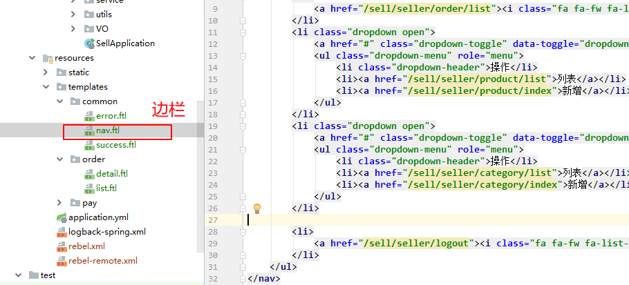
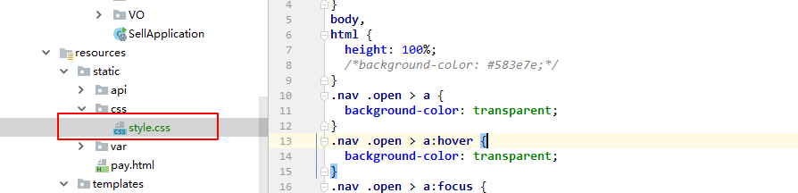
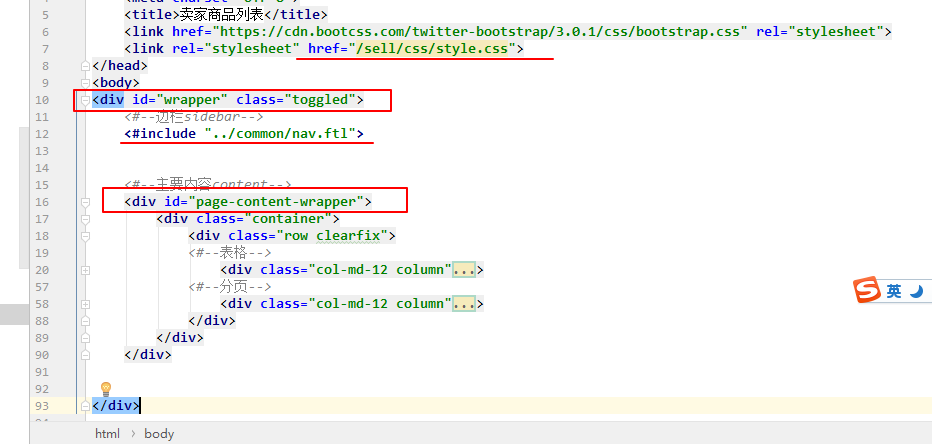
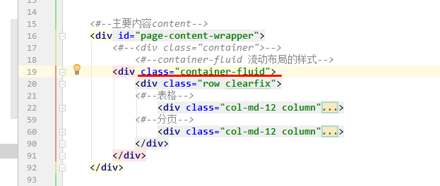
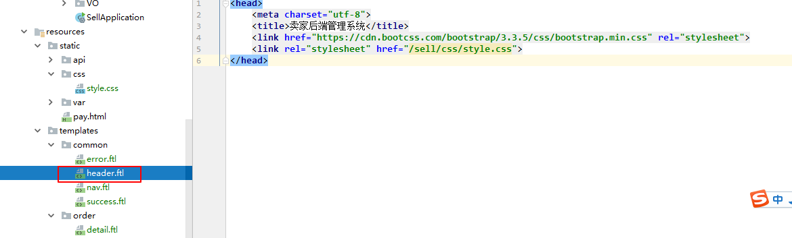
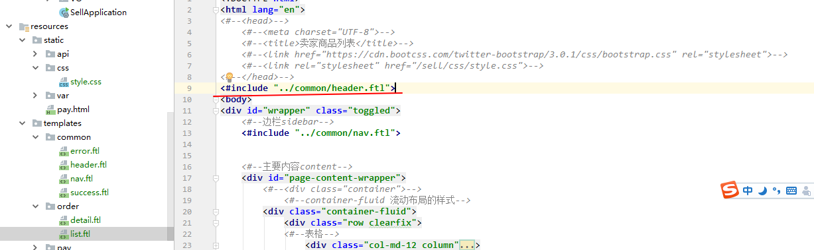
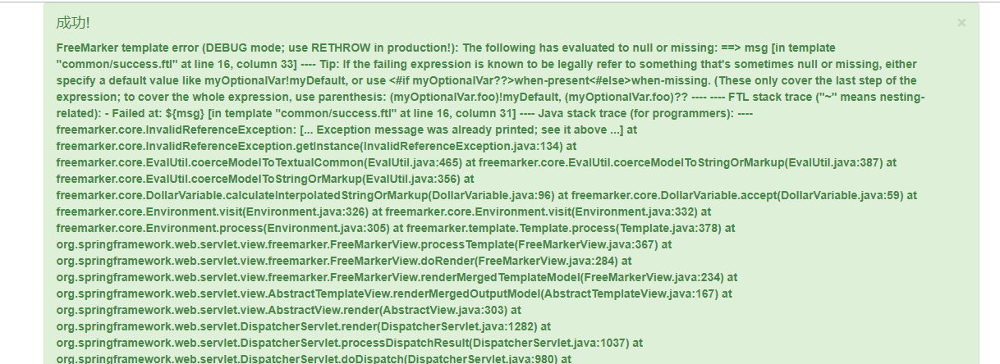
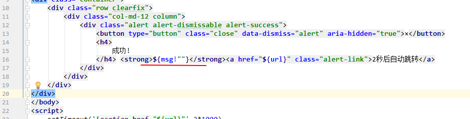

### 边栏实现

直接粘贴边栏代码到此处

样式粘贴到此处

优化卖家商品列表，显示边栏

引入style.css

增加了一个最外层的div   id = "wrapper" 和 div id="page-content-wrapper" ，把之前的表格放入page-content-wrapper里面。

修改主要内容div的样式，由`class="container"`改为`class="container-fluid"`,实现流动布局

添加公共的头信息header.ftl

注释掉之前的头信息引入公共的

#### 注意

报这个错误，是因为后台没有传msg给前端

修改前端页面，如果msg不存在就给一个空值

 

