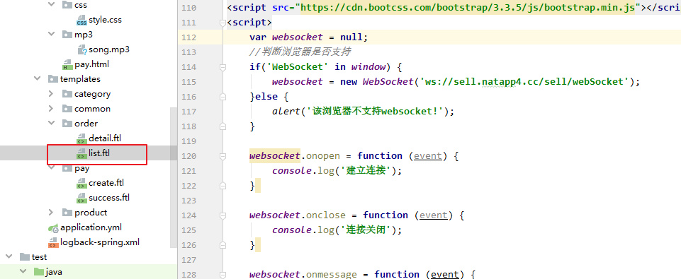
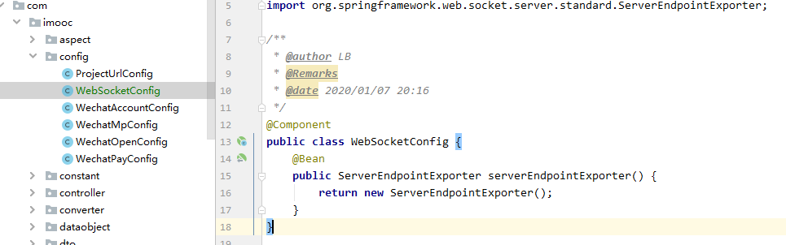
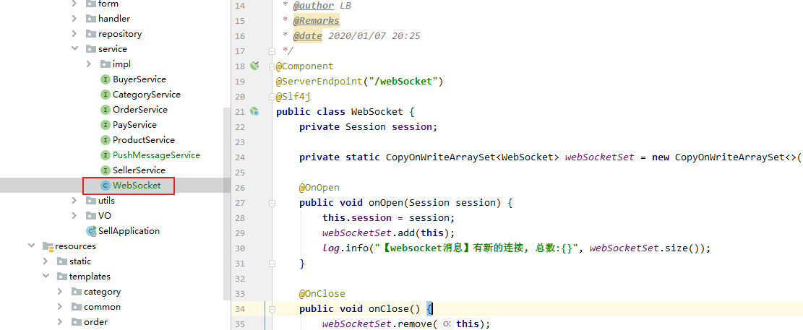
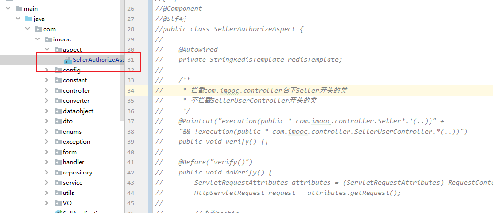
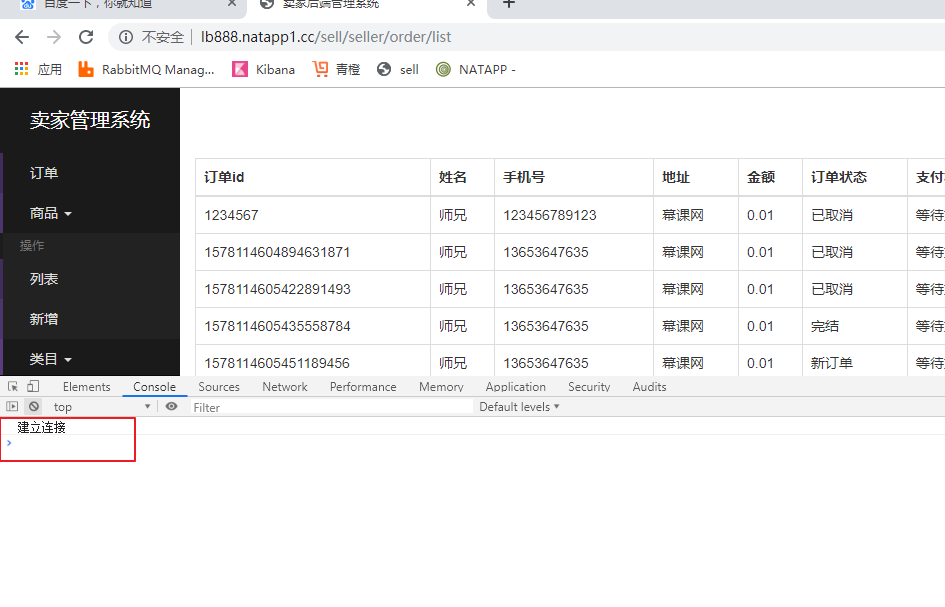
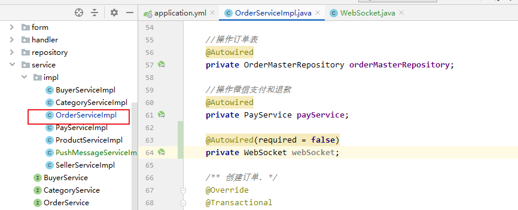
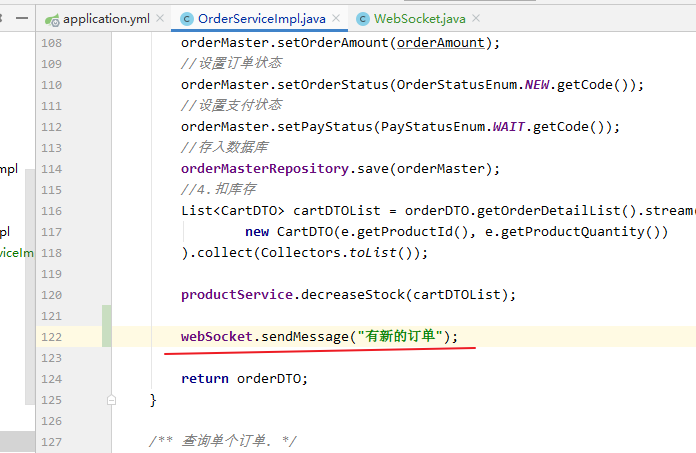
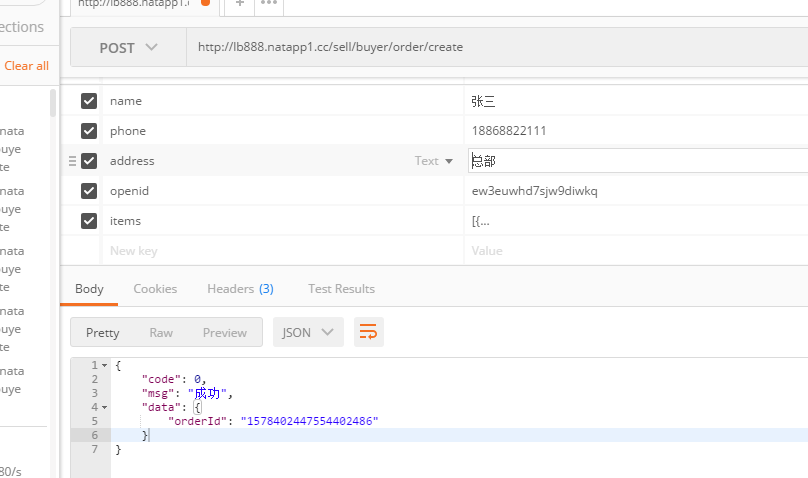
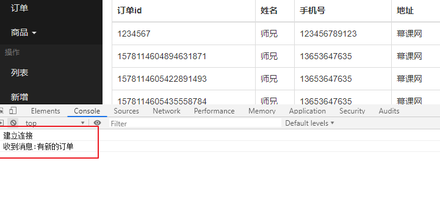

微信扫描登陆

#### AOP实现身份认证

```java
package com.imooc.aspect;

import com.imooc.constant.CookieConstant;
import com.imooc.constant.RedisConstant;
import com.imooc.exception.SellerAuthorizeException;
import com.imooc.utils.CookieUtil;
import lombok.extern.slf4j.Slf4j;
import org.aspectj.lang.annotation.Aspect;
import org.aspectj.lang.annotation.Before;
import org.aspectj.lang.annotation.Pointcut;
import org.springframework.beans.factory.annotation.Autowired;
import org.springframework.data.redis.core.StringRedisTemplate;
import org.springframework.stereotype.Component;
import org.springframework.util.StringUtils;
import org.springframework.web.context.request.RequestContextHolder;
import org.springframework.web.context.request.ServletRequestAttributes;

import javax.servlet.http.Cookie;
import javax.servlet.http.HttpServletRequest;

/**
 * Created by 廖师兄
 * 2017-07-30 17:31
 */
@Aspect
@Component
@Slf4j
public class SellerAuthorizeAspect {

    @Autowired
    private StringRedisTemplate redisTemplate;

    @Pointcut("execution(public * com.imooc.controller.Seller*.*(..))" +
    "&& !execution(public * com.imooc.controller.SellerUserController.*(..))")
    public void verify() {}

    @Before("verify()")
    public void doVerify() {
        ServletRequestAttributes attributes = (ServletRequestAttributes) RequestContextHolder.getRequestAttributes();
        HttpServletRequest request = attributes.getRequest();

        //查询cookie
        Cookie cookie = CookieUtil.get(request, CookieConstant.TOKEN);
        if (cookie == null) {
            log.warn("【登录校验】Cookie中查不到token");
            throw new SellerAuthorizeException();
        }

        //去redis里查询
        String tokenValue = redisTemplate.opsForValue().get(String.format(RedisConstant.TOKEN_PREFIX, cookie.getValue()));
        if (StringUtils.isEmpty(tokenValue)) {
            log.warn("【登录校验】Redis中查不到token");
            throw new SellerAuthorizeException();
        }
    }
}

```

#### 二微信公众号模板消息

官方文档https://developers.weixin.qq.com/doc/offiaccount/Message_Management/Template_Message_Interface.html

这里我们用第三方的SDK开发

```java
package com.imooc.service.impl;

import com.imooc.config.WechatAccountConfig;
import com.imooc.dto.OrderDTO;
import com.imooc.service.PushMessageService;
import lombok.extern.slf4j.Slf4j;
import me.chanjar.weixin.common.exception.WxErrorException;
import me.chanjar.weixin.mp.api.WxMpService;
import me.chanjar.weixin.mp.bean.template.WxMpTemplateData;
import me.chanjar.weixin.mp.bean.template.WxMpTemplateMessage;
import org.springframework.beans.factory.annotation.Autowired;
import org.springframework.stereotype.Service;

import java.util.Arrays;
import java.util.List;

/**
 * @author 微信模板消息推送
 * @Remarks
 * @date 2020/01/07 19:58
 */
@Service
@Slf4j
public class PushMessageServiceImpl implements PushMessageService {


    @Autowired
    private WxMpService wxMpService;

    @Autowired
    private WechatAccountConfig accountConfig;

    /**
     * 订单状态变更消息
     * @param orderDTO
     */
    @Override
    public void orderStatus(OrderDTO orderDTO) {
        WxMpTemplateMessage templateMessage = new WxMpTemplateMessage();
        //消息模板id
        templateMessage.setTemplateId(accountConfig.getTemplateId().get("orderStatus"));
        //用户的Openid
        templateMessage.setToUser(orderDTO.getBuyerOpenid());

        List<WxMpTemplateData> data = Arrays.asList(
                new WxMpTemplateData("first", "亲，请记得收货。"),
                new WxMpTemplateData("keyword1", "微信点餐"),
                new WxMpTemplateData("keyword2", "18868812345"),
                new WxMpTemplateData("keyword3", orderDTO.getOrderId()),
                new WxMpTemplateData("keyword4", orderDTO.getOrderStatusEnum().getMessage()),
                new WxMpTemplateData("keyword5", "￥" + orderDTO.getOrderAmount()),
                new WxMpTemplateData("remark", "欢迎再次光临！")
        );

        templateMessage.setData(data);
        try {
            wxMpService.getTemplateMsgService().sendTemplateMsg(templateMessage);
        }catch (WxErrorException e) {
            log.error("【微信模版消息】发送失败, {}", e);
        }
    }
}

```

#### 三webSocket消息推送

编写前端



```java
<script>
    var websocket = null;
    //判断浏览器是否支持
    if('WebSocket' in window) {
        websocket = new WebSocket('ws://sell.natapp4.cc/sell/webSocket');
    }else {
        alert('该浏览器不支持websocket!');
    }

    websocket.onopen = function (event) {
        console.log('建立连接');
    }

    websocket.onclose = function (event) {
        console.log('连接关闭');
    }

    websocket.onmessage = function (event) {
        console.log('收到消息:' + event.data)
    }

    websocket.onerror = function () {
        alert('websocket通信发生错误！');
    }

    window.onbeforeunload = function () {
        websocket.close();
    }

</script>
```

后台添加websocket依赖

```java
	<dependency>
			<groupId>org.springframework.boot</groupId>
			<artifactId>spring-boot-starter-websocket</artifactId>
		</dependency>
```

配置bean



```java
@Component
public class WebSocketConfig {
    @Bean
    public ServerEndpointExporter serverEndpointExporter() {
        return new ServerEndpointExporter();
    }
}
```

编写WebSocket



```java
package com.imooc.service;

import lombok.extern.slf4j.Slf4j;
import org.springframework.stereotype.Component;

import javax.websocket.OnClose;
import javax.websocket.OnMessage;
import javax.websocket.OnOpen;
import javax.websocket.Session;
import javax.websocket.server.ServerEndpoint;
import java.util.concurrent.CopyOnWriteArraySet;

/**
 * @author LB
 * @Remarks
 * @date 2020/01/07 20:25
 */
@Component
@ServerEndpoint("/webSocket")
@Slf4j
public class WebSocket {
    private Session session;

    private static CopyOnWriteArraySet<WebSocket> webSocketSet = new CopyOnWriteArraySet<>();

    @OnOpen
    public void onOpen(Session session) {
        this.session = session;
        webSocketSet.add(this);
        log.info("【websocket消息】有新的连接, 总数:{}", webSocketSet.size());
    }

    @OnClose
    public void onClose() {
        webSocketSet.remove(this);
        log.info("【websocket消息】连接断开, 总数:{}", webSocketSet.size());
    }

    @OnMessage
    public void onMessage(String message) {
        log.info("【websocket消息】收到客户端发来的消息:{}", message);
    }

    public void sendMessage(String message) {
        for (WebSocket webSocket: webSocketSet) {
            log.info("【websocket消息】广播消息, message={}", message);
            try {
                webSocket.session.getBasicRemote().sendText(message);
            } catch (Exception e) {
                e.printStackTrace();
            }
        }
    }
}

```

访问地址测试，如果没有权限访问先把登陆验证的代码注释掉



```
http://lb888.natapp1.cc/sell/seller/order/list
```

访问地址，控制台打印建立连接



订单service引入webSocket



创建订单添加webSocket



###### 测试


使用Postman模拟创建订单



```java
name: "张三"
phone: "18868822111"
address: "总部"
openid: "ew3euwhd7sjw9diwkq" //用户的微信openid
items: [{
    productId: "1423113435324",
    productQuantity: 2 //购买数量
}]
```

前端收到消息（先刷新前端页面建立连接，再使用postman创建新订单）



优化前端页面，有新订单给一个弹窗提醒，并播放音乐

```java
<#--弹窗-->
<div class="modal fade" id="myModal" role="dialog" aria-labelledby="myModalLabel" aria-hidden="true">
    <div class="modal-dialog">
        <div class="modal-content">
            <div class="modal-header">
                <button type="button" class="close" data-dismiss="modal" aria-hidden="true">×</button>
                <h4 class="modal-title" id="myModalLabel">
                    提醒
                </h4>
            </div>
            <div class="modal-body">
                你有新的订单
            </div>
            <div class="modal-footer">
                <button onclick="javascript:document.getElementById('notice').pause()" type="button" class="btn btn-default" data-dismiss="modal">关闭</button>
                <button onclick="location.reload()" type="button" class="btn btn-primary">查看新的订单</button>
            </div>
        </div>
    </div>
</div>
```


```java
<#--播放音乐-->
<audio id="notice" loop="loop">
    <source src="/sell/mp3/song.mp3" type="audio/mpeg" />
</audio>
```

```java
    websocket.onmessage = function (event) {
        console.log('收到消息:' + event.data)
        //弹窗提醒, 播放音乐
        $('#myModal').modal('show');
        document.getElementById('notice').play();
    }
```

