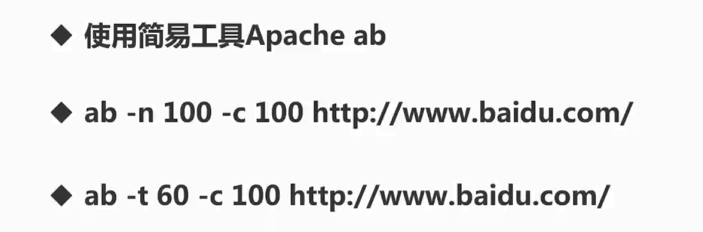
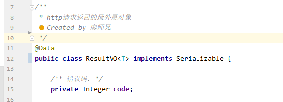
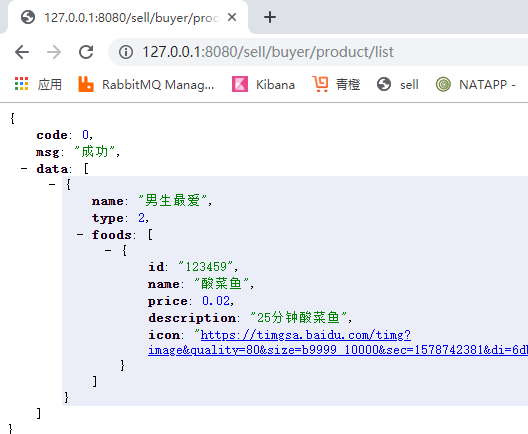

## 用压测模拟并发

使用简易工具Apache ab

ab -n 100 -c 105   模拟100个请求，105个并发

ab -t 60 -c 100 60秒发100个请求



## redis分布式锁

http://www.redis.cn redis中文网站

setnx 命令


getset命令


加入redis

```java
	<dependency>
			<groupId>org.springframework.boot</groupId>
			<artifactId>spring-boot-starter-data-redis</artifactId>
		</dependency>
```


两个关键的方法

```java
//只有在 key不存在时设置 key 的值   之前已经存在返回false,不存在返回true
redisTemplate.opsForValue().setIfAbsent(key, value)
```

```java
//getAndSet 将给定 key的值设为 value ，并返回 key 的旧值(old value)
String oldValue = redisTemplate.opsForValue().getAndSet(key, value);
```

```java
//删除key
redisTemplate.opsForValue().getOperations().delete(key)
```

```java
package com.imooc.service;

/**
 * @author LB
 * @Remarks
 * @date 2020/01/07 22:08
 */
@Component
@Slf4j
public class RedisLock {

    @Autowired
    private StringRedisTemplate redisTemplate;

    /**
     *加锁
     * @param key
     * @param value 当前时间+超时时间
     * @return
     */
    public boolean lock(String key,String value){
        //只有在 key不存在时设置 key 的值   之前已经存在返回false,不存在返回true
        if(redisTemplate.opsForValue().setIfAbsent(key, value)) {
            //设置 key 的值 成功
            return true;
        }
        
        //---防止（获取锁后业务代码报错造成没有解锁）死锁开始
        String currentValue = redisTemplate.opsForValue().get(key);
        //如果锁过期
        //!StringUtils.isEmpty(currentValue)   内容不为空
        //Long.parseLong(currentValue) < System.currentTimeMillis()  小于当前时间
        if (!StringUtils.isEmpty(currentValue) && Long.parseLong(currentValue) < System.currentTimeMillis()) {
            //获取上一个锁的时间
            //getAndSet 将给定 key的值设为 value ，并返回 key 的旧值(old value)
            String oldValue = redisTemplate.opsForValue().getAndSet(key, value);
            //oldValue 不为空并和当前的value相等
            if (!StringUtils.isEmpty(oldValue) && oldValue.equals(currentValue)) {
                return true;
            }
        }
        //---防止死锁结束
        return false;
    }


    /**
     * 解锁
     * @param key
     * @param value
     */
    public void unlock(String key, String value) {
        try {
            String currentValue = redisTemplate.opsForValue().get(key);
            if (!StringUtils.isEmpty(currentValue) && currentValue.equals(value)) {
                redisTemplate.opsForValue().getOperations().delete(key);
            }
        }catch (Exception e) {
            log.error("【redis分布式锁】解锁异常, {}", e);
        }
    }
}

```

业务代码

```java
 @Override
    public void orderProductMockDiffUser(String productId)
    {
        //加锁
        long time = System.currentTimeMillis()+TIMEOUT;
        if(!redisLock.lock(productId,String.valueOf(time))){
            throw new SellException(101,"抢的人太多了，换个姿势试试");
        }
        //1.查询该商品库存，为0则活动结束。
        int stockNum = stock.get(productId);
        if(stockNum == 0) {
            throw new SellException(100,"活动结束");
        }else {
            //2.下单(模拟不同用户openid不同)
            orders.put(KeyUtil.genUniqueKey(),productId);
            //3.减库存
            stockNum =stockNum-1;
            try {
                Thread.sleep(100);
            } catch (InterruptedException e) {
                e.printStackTrace();
            }
            stock.put(productId,stockNum);
        }
        //解锁
        redisLock.unlock(productId,String.valueOf(time));
    }
```

## redis缓存的应用---注解方式

加redis配置和依赖


```java
  redis:
    host: 127.0.0.1
    port: 6379
```

```java
     <dependency>
            <groupId>org.springframework.boot</groupId>
            <artifactId>spring-boot-starter-data-redis</artifactId>
        </dependency>
```

### 启动类加注解@EnableCaching  (依雷波咔寻)


查看maven依赖关系


ctrl+F 查找依赖


项目中已经有了这个依赖所以我们不需要引入。如果项目中没有的需要引入下面的依赖

```java
        <dependency>
            <groupId>org.springframework.boot</groupId>
            <artifactId>spring-boot-starter-cache</artifactId>
        </dependency>
```

### 买家商品列表加上缓存注解  @Cacheable

```java
  @Cacheable(cacheNames = "product",key = "123")
```


启动项目访问


#### 注意：报错原因是ResultVO没有序列化

解决方法

ResultVO继承Serializable接口



[自动生成 serialVersionUID 的设置](https://www.cnblogs.com/godtrue/p/7674487.html)

使用idea自动生成serialVersionUID


完成后继续访问接口已经有数据了，并且也缓存进了redis，下一次查询就不再访问接口而是直接从redis中拿数据

数据



redis


### 如何保证缓存和数据库同步

更新商品或增加商品接口加注解

#### 方法一： @CacheEvict 注解，表示更新或增加商品时删除缓存

```java
   @CacheEvict(cacheNames = "product", key = "123")
```

#### 方式二：@CachePut注解，表示更新或增加商品时同步缓存（使用时需要注意返回的对象必须和查询时返回的对象一致）

###### 重点：使用@CachePut注解时需要注意返回的对象必须和查询时返回的对象一致

```java
@CachePut(cacheNames = "product",key = "123")
```

如下图返回的是同一个商品信息：


关于key，如果不填或者为空，那么默认key为方法的参数，

##### 如果保存和查询key不同将影响缓存的同步


简写


#### @Cacheable注解的其他参数


unless的意思是如果不，所以想表示Code=0进行缓存，需要 用  ！= 0


### 总结：

记住三个注解：@EnableCaching  、@Cacheable、@CacheEvict 、@CachePut

@EnableCaching （读音：依雷波咔寻）启动类加EnableCaching 注解 表示启用缓存

@Cacheable	(读音：开k耳跛)       缓存注解

保证缓存和数据库同步的注解：

@CacheEvict(读音：咔西内特) ：表示更新或增加商品时删除缓存

@CachePut(读音: 咔西瀑特)：表示更新或增加商品时同步缓存（使用时需要注意返回的对象必须和查询时返回的对象一致）