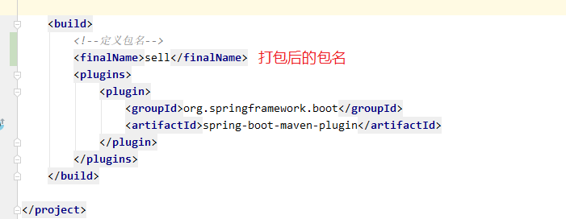
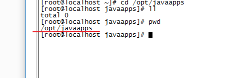

```java
pwd     查看包名称
```

1放到此目录下




```java
从windows上传到linux
在CRT下,Alt+P
```

3

```java
移动sell.jar到 /opt/javaapps下
mv sell.jar /opt/javaapps
```


```java
-- 启动sell.jar程序
java -jar sell.jar  
--  启动程序并指定端口
java -jar -Dserver.port=8090 sell.jar
-- 指定端口和环境
java -jar -Dserver.port=8090 -Dspring.profiles.active=prod sell.jar

-- 在后台运行
nohup java -jar sell.jar > /dev/null 2>&1 &
--查看程序进程
ps -ef |grep sell.jar
```

