## 微信网页授权，获取openId

### 原始授权链接的解释

https://mp.weixin.qq.com访问微信公众平台，查看开发文档

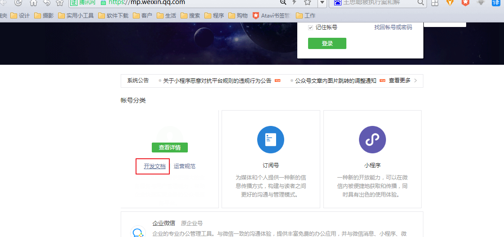


选择微信网页开发，网页授权

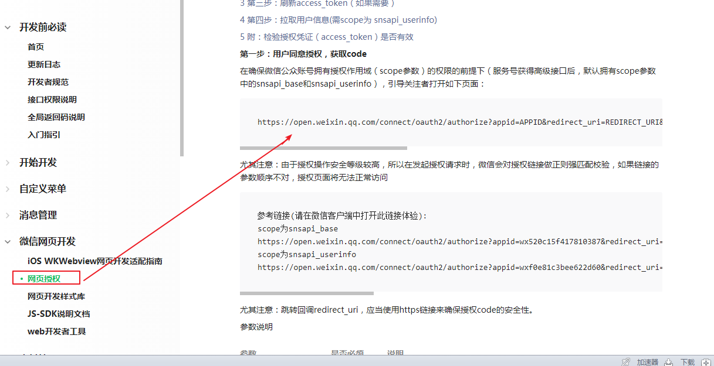

原始授权链接的解释：

```java
https://open.weixin.qq.com/connect/oauth2/authorize?appid=APPID&redirect_uri=REDIRECT_URI&response_type=code&scope=SCOPE&state=STATE#wechat_redirect

appid：公众号的appid

redirect_uri：授权回调页面域名（如果用户同意授权，页面将跳转至 redirect_uri/?code=CODE&state=STATE）

state:自定义携带的参数

scope：应用授权作用域，snsapi_base （不弹出授权页面，直接跳转，只能获取用户openid），snsapi_userinfo （弹出授权页面，可通过openid拿到昵称、性别、所在地。并且， 即使在未关注的情况下，只要用户授权，也能获取其信息 ）
```

### 填写授权链接参数

#### 填写appid


```java
//填写appid
https://open.weixin.qq.com/connect/oauth2/authorize?appid=wx94c59d4d078a3199&redirect_uri=REDIRECT_URI&response_type=code&scope=SCOPE&state=STATE#wechat_redirect
```

##### 找到自己微信公众号的appid（这里使用微信提供的测试账号）

（1）

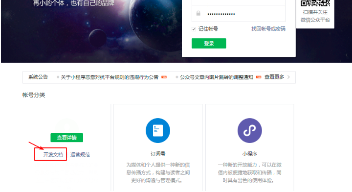

（2）

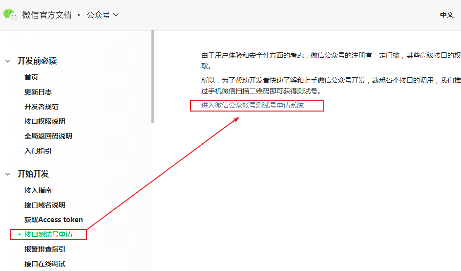

（3）

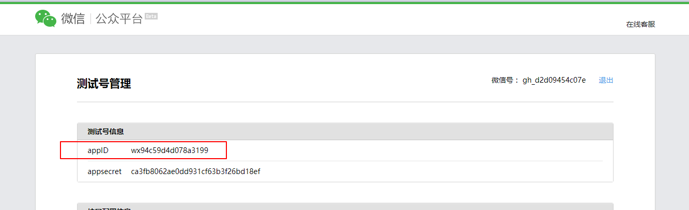


##### 填写其他参数


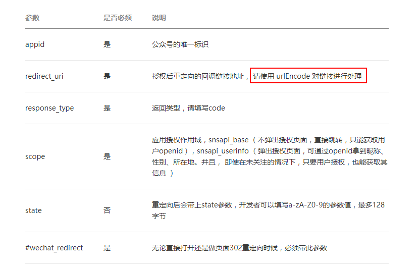

#### 填写redirect_uri

使用内网穿透natapp（https://natapp.cn/login），得到一个域名（urlEncode）

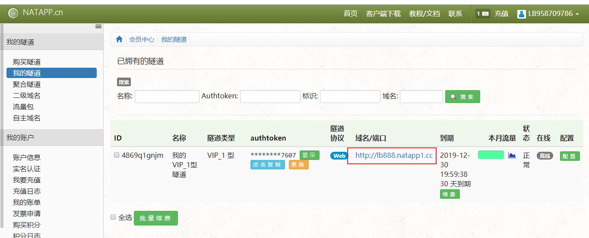

下载natapp客户端把域名映射到本地，

教程连接

https://natapp.cn/article/natapp_newbie

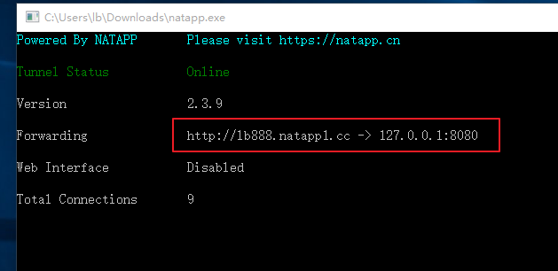

#####  填写redirect_uri 并对 网站进行urlEncode处理

  URl在线工具  http://tool.chinaz.com/tools/urlencode.aspx

编码前

```java
https://open.weixin.qq.com/connect/oauth2/authorize?appid=wx94c59d4d078a3199&redirect_uri=http://lb888.natapp1.cc&response_type=code&scope=snsapi_base&state=STATE#wechat_redirect
```

编码后

```java
https://open.weixin.qq.com/connect/oauth2/authorize?appid=wx94c59d4d078a3199&redirect_uri=http%3a%2f%2flb888.natapp1.cc&response_type=code&scope=snsapi_base&state=STATE#wechat_redirect
```

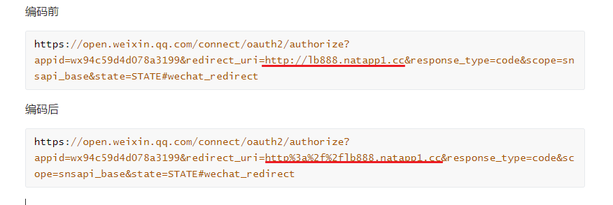

#### 填写scope=snsapi_base

scope：应用授权作用域，snsapi_base （不弹出授权页面，直接跳转，只能获取用户openid），snsapi_userinfo （弹出授权页面，可通过openid拿到昵称、性别、所在地。并且， 即使在未关注的情况下，只要用户授权，也能获取其信息 ）

```java
https://open.weixin.qq.com/connect/oauth2/authorize?appid=wx94c59d4d078a3199&redirect_uri=http%3a%2f%2flb888.natapp1.cc&response_type=code&scope=snsapi_base&state=STATE#wechat_redirect
```

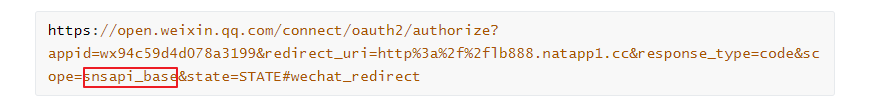

#### 设置授权回调页面地址（在测试号里）

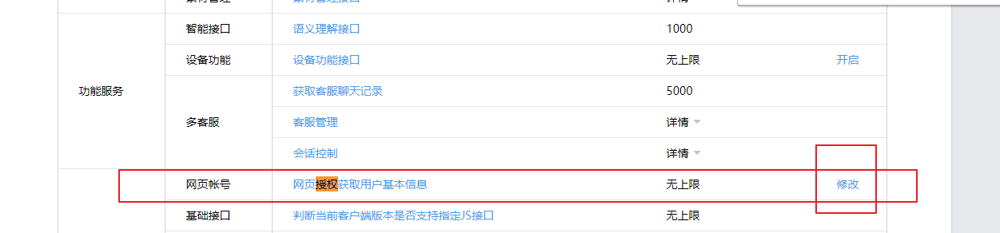

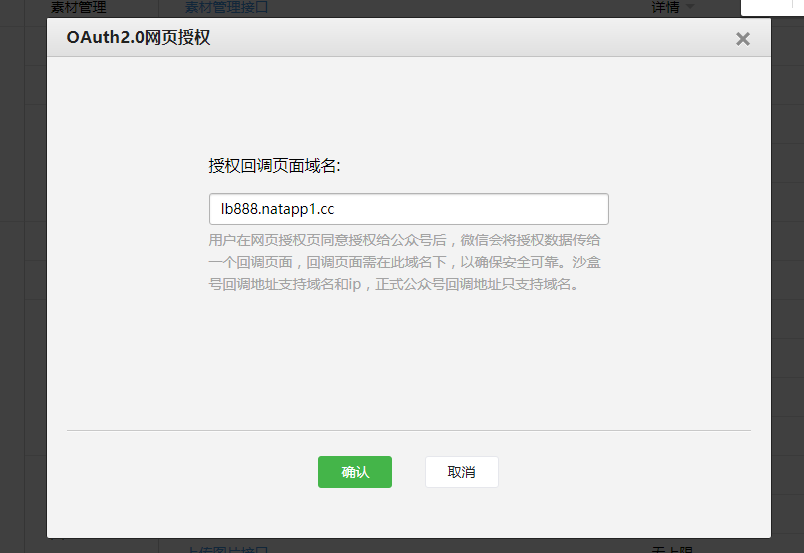

##### 使用微信关注测试公众号

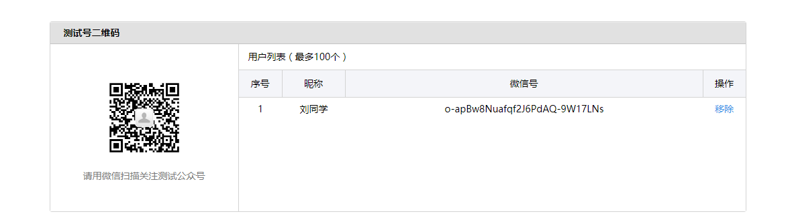

使用微信访问刚才的地址

```java
https://open.weixin.qq.com/connect/oauth2/authorize?appid=wx94c59d4d078a3199&redirect_uri=http%3a%2f%2flb888.natapp1.cc&response_type=code&scope=snsapi_base&state=STATE#wechat_redirect
```

访问成功

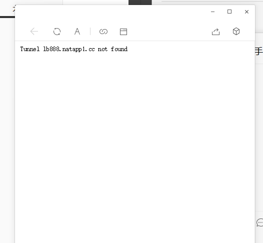

```java
https://open.weixin.qq.com/connect/oauth2/authorize?appid=wx94c59d4d078a3199&redirect_uri=http%3a%2f%2flb888.natapp1.cc/sell/wechat/userInfo&response_type=code&scope=snsapi_base&state=STATE#wechat_redirect

appid：公众号的appid

redirect_uri：授权回调页面域名（如果用户同意授权，页面将跳转至 redirect_uri/?code=CODE&state=STATE）

state:自定义携带的参数

scope：应用授权作用域，snsapi_base （不弹出授权页面，直接跳转，只能获取用户openid），snsapi_userinfo （弹出授权页面，可通过openid拿到昵称、性别、所在地。并且， 即使在未关注的情况下，只要用户授权，也能获取其信息 ）

微信访问这个网址会重定向到http%3a%2f%2flb888.natapp1.cc/sell/wechat/userInfo，并携带code和state参数

```


#####  微信访问这个网址会重定向到http%3a%2f%2flb888.natapp1.cc/sell/wechat/userInfo，并携带code和state参数

### 手工方式获取openid

```java
https://open.weixin.qq.com/connect/oauth2/authorize?appid=wx94c59d4d078a3199&redirect_uri=http%3a%2f%2flb888.natapp1.cc/sell/weixin/auth&response_type=code&scope=snsapi_base&state=STATE#wechat_redirect

redirect_uri:授权回调页面域名（如果用户同意授权，页面将跳转至 redirect_uri/?code=CODE&state=STATE）
redirect_uri写什么地址，code和state就返回给那个地址

打开微信访问此地址
```

打开后进入了此方法

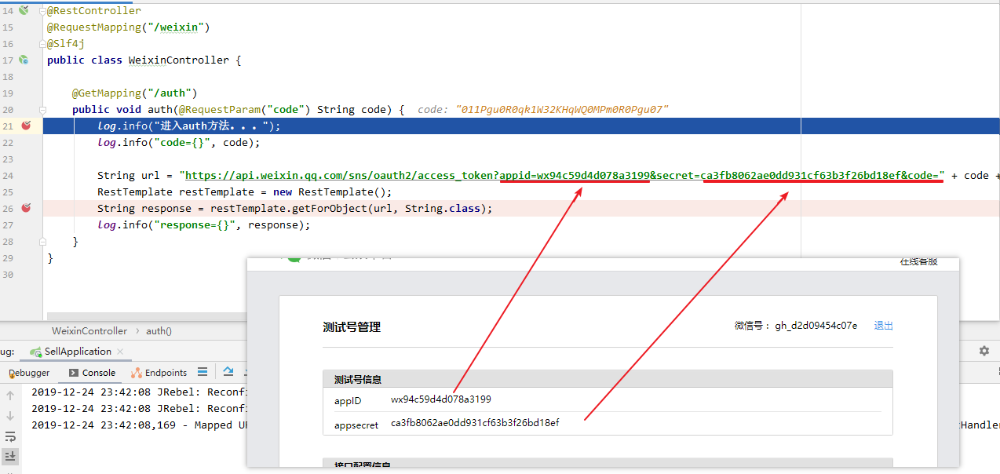

```java
package com.imooc.controller;

import lombok.extern.slf4j.Slf4j;
import org.springframework.web.bind.annotation.GetMapping;
import org.springframework.web.bind.annotation.RequestMapping;
import org.springframework.web.bind.annotation.RequestParam;
import org.springframework.web.bind.annotation.RestController;
import org.springframework.web.client.RestTemplate;

@RestController
@RequestMapping("/weixin")
@Slf4j
public class WeixinController {

    @GetMapping("/auth")
    public void auth(@RequestParam("code") String code) {
        log.info("进入auth方法。。。");
        log.info("code={}", code);

        String url = "https://api.weixin.qq.com/sns/oauth2/access_token?appid=wx94c59d4d078a3199&secret=ca3fb8062ae0dd931cf63b3f26bd18ef&code=" + code + "&grant_type=authorization_code";
        RestTemplate restTemplate = new RestTemplate();
        String response = restTemplate.getForObject(url, String.class);
        log.info("response={}", response);
    }
}

```


获得一个带有openid的JSON字符串

```java
response={"access_token":"28_x32NMtO4xP8N1MFH1-RkXSUR3jwaq9Vup6i8HJbrXNHInVfoefTkEjwtSrVMsKdW-iIjKwy6jPwvCwjIkgMcmddFUFIL1Z2lpUCBNKAHFWU","expires_in":7200,"refresh_token":"28_lR0qkljpYcaP00Z7n02rF-dYllKIYjauQFXEuQ3vCtrOX6O-UHkKyHSKSzR0aWXMoPydnzqlZsU4qx4C8byUH0qtOM1EkR8ih4J4Ooka5Jo","openid":"o-apBw8Nuafqf2J6PdAQ-9W17LNs","scope":"snsapi_base"}
```

### 第三方SDK获取openid

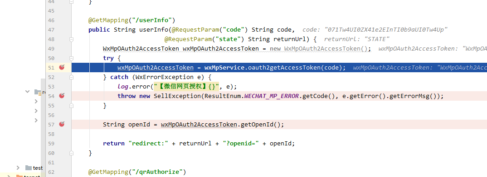

```java
package com.imooc.controller;

import com.imooc.config.ProjectUrlConfig;
import com.imooc.enums.ResultEnum;
import com.imooc.exception.SellException;
import lombok.extern.slf4j.Slf4j;
import me.chanjar.weixin.common.api.WxConsts;
import me.chanjar.weixin.common.exception.WxErrorException;
import me.chanjar.weixin.mp.api.WxMpService;
import me.chanjar.weixin.mp.bean.result.WxMpOAuth2AccessToken;
import org.springframework.beans.factory.annotation.Autowired;
import org.springframework.stereotype.Controller;
import org.springframework.web.bind.annotation.GetMapping;
import org.springframework.web.bind.annotation.RequestMapping;
import org.springframework.web.bind.annotation.RequestParam;

import java.net.URLEncoder;

/**
 * @author LB
 * @Remarks
 * @date 2019/11/27 23:34
 */
@Controller
@RequestMapping("/wechat")
@Slf4j
/**
 * SDK方式获取openId
 */
public class WechatController {

    @Autowired(required = false)
    private WxMpService wxMpService;
    @Autowired
    private WxMpService wxOpenService;

    @Autowired
    private ProjectUrlConfig projectUrlConfig;

    @GetMapping("/authorize")
    public String authorize(@RequestParam("returnUrl") String returnUrl) {
        //1. 配置
        //2. 调用方法
        String url = projectUrlConfig.getWechatMpAuthorize() + "/sell/wechat/userInfo";
        //arg1: redirect_uri	是	授权后重定向的回调链接地址， 请使用 urlEncode 对链接进行处理
        //arg2: scope	是	应用授权作用域，snsapi_base （不弹出授权页面，直接跳转，只能获取用户openid），snsapi_userinfo （弹出授权页面，可通过openid拿到昵称、性别、所在地。并且， 即使在未关注的情况下，只要用户授权，也能获取其信息 ）
        //arg3: state	否	重定向后会带上state参数，开发者可以填写a-zA-Z0-9的参数值，最多128字节
        String redirectUrl = wxMpService.oauth2buildAuthorizationUrl(url, WxConsts.OAUTH2_SCOPE_USER_INFO, URLEncoder.encode(returnUrl));
        //result=https://open.weixin.qq.com/connect/oauth2/authorize?appid=wx94c59d4d078a3199&redirect_uri=http%3A%2F%2Flb888.natapp1.cc%2Fsell%2Fwechat%2FuserInfo&response_type=code&scope=snsapi_userinfo&state=http%3A%2F%2Fwww.imooc.com#wechat_redirect
        log.info("【微信网页授权】获取code，result={}",redirectUrl);
        return "redirect:" + redirectUrl;
    }

    @GetMapping("/userInfo")
    public String userInfo(@RequestParam("code") String code,
                           @RequestParam("state") String returnUrl) {
        WxMpOAuth2AccessToken wxMpOAuth2AccessToken = new WxMpOAuth2AccessToken();
        try {
            wxMpOAuth2AccessToken = wxMpService.oauth2getAccessToken(code);
        } catch (WxErrorException e) {
            log.error("【微信网页授权】{}", e);
            throw new SellException(ResultEnum.WECHAT_MP_ERROR.getCode(), e.getError().getErrorMsg());
        }

        String openId = wxMpOAuth2AccessToken.getOpenId();

        return "redirect:" + returnUrl + "?openid=" + openId;
    }

    //微信开放平台扫码登陆获取opendId

    @GetMapping("/qrAuthorize")
    public String qrAuthorize(@RequestParam("returnUrl") String returnUrl) {
        String url = projectUrlConfig.getWechatOpenAuthorize() + "/sell/wechat/qrUserInfo";
        String redirectUrl = wxOpenService.buildQrConnectUrl(url, WxConsts.QRCONNECT_SCOPE_SNSAPI_LOGIN, URLEncoder.encode(returnUrl));
        return "redirect:" + redirectUrl;
    }

    @GetMapping("/qrUserInfo")
    public String qrUserInfo(@RequestParam("code") String code,
                             @RequestParam("state") String returnUrl) {
        WxMpOAuth2AccessToken wxMpOAuth2AccessToken = new WxMpOAuth2AccessToken();
        try {
            wxMpOAuth2AccessToken = wxOpenService.oauth2getAccessToken(code);
        } catch (WxErrorException e) {
            log.error("【微信网页授权】{}", e);
            throw new SellException(ResultEnum.WECHAT_MP_ERROR.getCode(), e.getError().getErrorMsg());
        }
        log.info("wxMpOAuth2AccessToken={}", wxMpOAuth2AccessToken);
        String openId = wxMpOAuth2AccessToken.getOpenId();

        return "redirect:" + returnUrl + "?openid=" + openId;
    }


}

```

