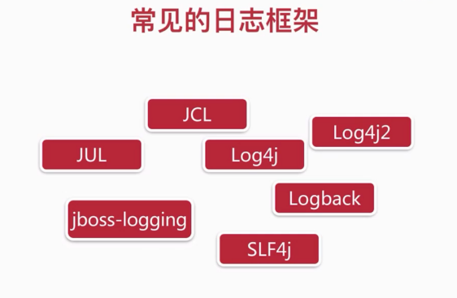
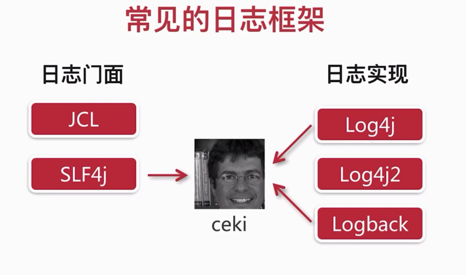
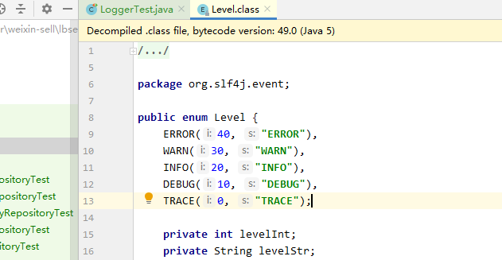
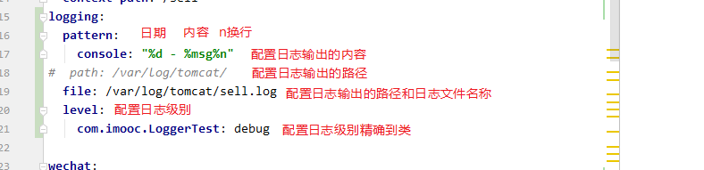
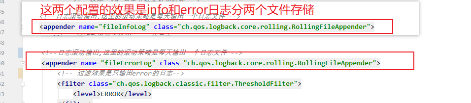
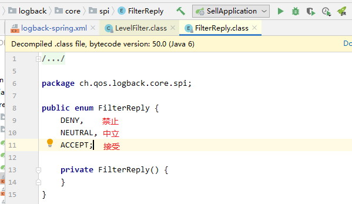
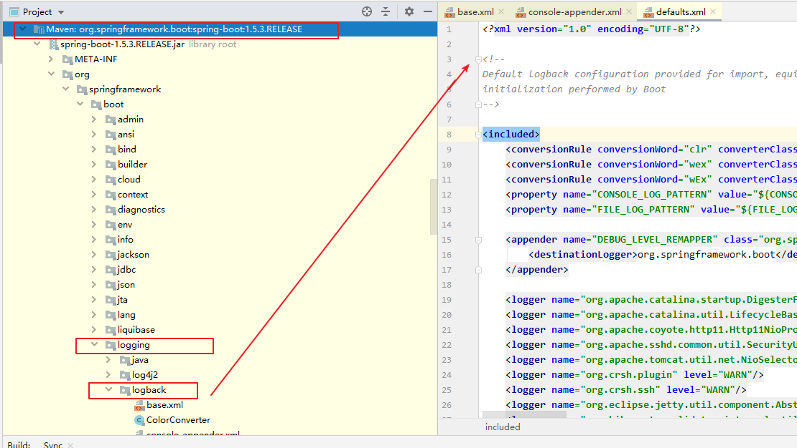

## 日志使用





Logback是Log4j的升级版，作者ceki不对Log4j进行更新了。

我们使用Logback

日志级别，默认info，在项目中控制台只会显示比他高的级别的信息




加入该依赖可以用@slf4注解， 使用这个依赖需要安装 lombok插件

```java
   <dependency>
            <groupId>org.projectlombok</groupId>
            <artifactId>lombok</artifactId>
        </dependency>
```


```java
package com.imooc;

import lombok.extern.slf4j.Slf4j;
import org.junit.Test;
import org.junit.runner.RunWith;
import org.slf4j.LoggerFactory;
import org.springframework.boot.test.context.SpringBootTest;
import org.springframework.test.context.junit4.SpringRunner;
@RunWith(SpringRunner.class)
@SpringBootTest
@Slf4j
public class LoggerTest {
    @Test
    public void test1() {
        String name = "imooc";
        String password = "123456";
        log.debug("debug...");
        log.info("name: " + name + " ,password: " + password);
        log.info("name: {}, password: {}", name, password);
        log.error("error...");
        log.warn("warn...");
    }
}

```

yml 文件的日志配置

```java
logging:
  pattern:
    console: "%d - %msg%n"   
#  path: /var/log/tomcat/
  file: /var/log/tomcat/sell.log
  level:
    com.imooc.LoggerTest: debug
```



yml只能配基本的信息，具体配置我们在xml文件中配置

```xml
<?xml version="1.0" encoding="UTF-8" ?>

<configuration>
    <!--控制台按照日期-信息格式输出-->
    <appender name="consoleLog" class="ch.qos.logback.core.ConsoleAppender">
        <layout class="ch.qos.logback.classic.PatternLayout">
            <pattern>
                %d - %msg%n
            </pattern>
        </layout>
    </appender>


    <!--日志滚动输出,这里的滚动策略是每天输出一个日志文件 -->
    <appender name="fileInfoLog" class="ch.qos.logback.core.rolling.RollingFileAppender">
        <!-- 过滤效果是不输出error的日志-->
        <filter class="ch.qos.logback.classic.filter.LevelFilter">
            <!--需要过滤的日志级别-->
            <level>ERROR</level>
            <!--如果匹配就禁止-->
            <!--如果是ERROR级别的日志就禁止（不打印）-->
            <onMatch>DENY</onMatch>
            <!--如果不匹配就接受-->
            <!--如果bu是ERROR级别的日志就接受（打印）-->
            <onMismatch>ACCEPT</onMismatch>
        </filter>
        <encoder>
            <pattern>
                %msg%n
            </pattern>
        </encoder>
        <!--滚动策略-->
        <rollingPolicy class="ch.qos.logback.core.rolling.TimeBasedRollingPolicy">
            <!--路径  %d 日志文件名称加时间 -->
            <fileNamePattern>C:/IDEA_WorkSpace/weixin-sell/info.%d.log</fileNamePattern>
        </rollingPolicy>
    </appender>

    <!--日志滚动输出,这里的滚动策略是每天输出一个日志文件 -->
    <appender name="fileErrorLog" class="ch.qos.logback.core.rolling.RollingFileAppender">
        <!-- 过滤效果是只输出error的日志-->
        <filter class="ch.qos.logback.classic.filter.ThresholdFilter">
            <level>ERROR</level>
        </filter>
        <encoder>
            <pattern>
                %msg%n
            </pattern>
        </encoder>
        <!--滚动策略-->
        <rollingPolicy class="ch.qos.logback.core.rolling.TimeBasedRollingPolicy">
            <!--路径-->
            <fileNamePattern>C:/IDEA_WorkSpace/weixin-sell/error.%d.log</fileNamePattern>
        </rollingPolicy>
    </appender>

	<!--root表示适用整个项目-->
	<!--level="info" 日志级别为info-->
    <root level="info">
        <appender-ref ref="consoleLog" />
        <appender-ref ref="fileInfoLog" />
        <appender-ref ref="fileErrorLog" />
    </root>

</configuration>
```








查看springboot默认的logback日志

