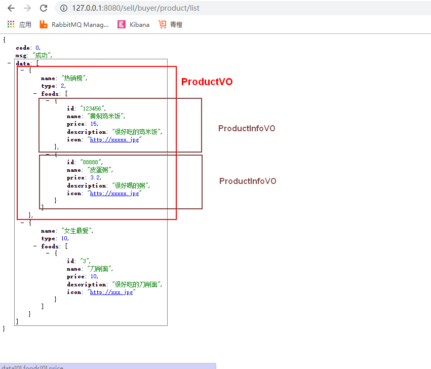

##### 结果数据分析



#### controller

```java
package com.imooc.controller;

import com.imooc.VO.ProductInfoVO;
import com.imooc.VO.ProductVO;
import com.imooc.VO.ResultVO;
import com.imooc.dataobject.ProductCategory;
import com.imooc.dataobject.ProductInfo;
import com.imooc.service.CategoryService;
import com.imooc.service.ProductService;
import org.springframework.beans.BeanUtils;
import org.springframework.beans.factory.annotation.Autowired;
import org.springframework.context.annotation.Bean;
import org.springframework.web.bind.annotation.GetMapping;
import org.springframework.web.bind.annotation.RequestMapping;
import org.springframework.web.bind.annotation.RestController;
import sun.plugin.com.BeanClass;

import java.util.ArrayList;
import java.util.Arrays;
import java.util.List;
import java.util.stream.Collectors;

/**
 * @author LB
 * @Remarks 买家商品
 * @date 2019/11/02 17:14
 */
@RestController
@RequestMapping("/buyer/product")
public class BuyerProductController {

    @Autowired
    private ProductService productService;

    @Autowired
    private CategoryService categoryService;

    //买家商品列表
    @GetMapping("/list")
    public ResultVO list(){
        //1.查询所有上架商品
        List<ProductInfo> productInfoList = productService.findUpAll();

        //2.查询类目（一次性查询）
        //2.1 传统方法
//        List<Integer> categoryList = new ArrayList<>();
//        for (ProductInfo productInfo : productInfoList) {
//            categoryList.add(productInfo.getCategoryType());
//        }
        //2.1精简方法
        List<Integer> categoryList = productInfoList.stream().map(e -> e.getCategoryType()).collect(Collectors.toList());
        List<ProductCategory> productCategoryList = categoryService.findByCategoryTypeIn(categoryList);

        //3.数据拼装
        List<ProductVO> productVOList = new ArrayList<>();
        for (ProductCategory productCategory : productCategoryList) {
            ProductVO productVO = new ProductVO();
            productVO.setCategoryType(productCategory.getCategoryType());
            productVO.setCategoryName(productCategory.getCategoryName());

            List<ProductInfoVO> productInfoVOList =new ArrayList<>();;
            for (ProductInfo productInfo : productInfoList) {
                if(productInfo.getCategoryType().equals(productCategory.getCategoryType())){
                    ProductInfoVO productInfoVO = new ProductInfoVO();
                    //productInfo属性值复制给productInfoVO
                    BeanUtils.copyProperties(productInfo,productInfoVO);
                    productInfoVOList.add(productInfoVO);
                }
            }
            productVO.setProductInfoVOList(productInfoVOList);
            productVOList.add(productVO);
        }
        ResultVO<Object> resultVO = new ResultVO<>();
        resultVO.setCode(0);
        resultVO.setMsg("成功");
        resultVO.setData(productVOList);
        return resultVO;
    }

}

```

#### service

```java
package com.imooc.service.impl;

/**
 * @author LB
 * @Remarks 商品
 * @date 2019/11/02 16:14
 */
@Service
public class ProductServiceImpl implements ProductService {

    @Autowired
    private ProductInfoRepository repository;

    /**
     * 查询所有在架商品列表
     * @return
     */
    @Override
    public List<ProductInfo> findUpAll() {
        return repository.findByProductStatus(ProductStatusEnum.UP.getCode());
    }

   
}

```

```java
package com.imooc.service.impl;
/**
 * @author LB
 * @Remarks
 * @date 2019/11/02 15:50
 */
//类目
@Service
public class CategoryServiceImpl implements CategoryService {

    @Autowired
    private ProductCategoryRepository repository;

    @Override
    public List<ProductCategory> findByCategoryTypeIn(List<Integer> categoryTypeList) {
        return repository.findByCategoryTypeIn(categoryTypeList);
    }

}

```

#### Dao

```java
package com.imooc.repository;

import com.imooc.dataobject.ProductInfo;
import org.springframework.data.jpa.repository.JpaRepository;

import java.util.List;

//商品
public interface ProductInfoRepository extends JpaRepository<ProductInfo,String> {

    //获取所有上架/下架的商品
    List<ProductInfo> findByProductStatus(Integer productStatus);

}

```

```java
package com.imooc.repository;

import com.imooc.dataobject.ProductCategory;
import org.springframework.data.jpa.repository.JpaRepository;

import java.util.List;
//类目
public interface ProductCategoryRepository extends JpaRepository<ProductCategory,Integer> {
    List<ProductCategory> findByCategoryTypeIn(List<Integer> categoryTypeList);
}

```

