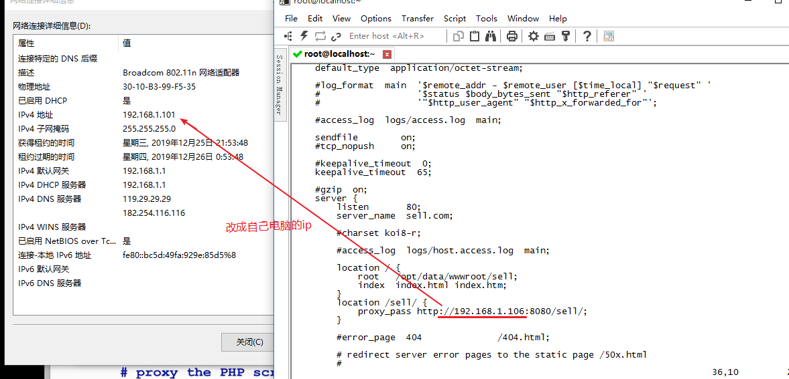

### 浏览器访问虚拟机ip


结果


Cookies里没有值，我们给他设置


 手动输入Cookies,随意设置一个openid


这时再查看Cookies,已经有了我们设置的值


再次访问虚拟机地址[http://192.168.211.130](http://192.168.211.130/)，就可以看到页面了


没有商品是因为访问的地址不对。我们需要修改虚拟机中nginx配置


### 输入命令编辑配置文件

```java
vim /usr/local/nginx/conf/nginx.conf
```

######  编辑   

- 打开文件：vi file  ,处在命令模式  ; 

  ```
  命令模式------(i)----->编辑模式-----(Esc)----->  命令模式-----(:)----->  底行模式
  ```

- 退出：esc->:q

- 修改文件：输入i进入插入模式

  保存并退出：先输入esc(切换到命令模式), 在输入:(切换到底行模式), 最后输入  wq

  不保存退出：先输入esc(切换到命令模式), 在输入:(切换到底行模式), 最后输入  q

- vi的模式

  命令模式:对行进行操作 移动光标.  切换到命令行模式：按Esc键

  ​	命令模式常用的快捷键

  ​	yy:复制当前行

  ​	p:粘贴

  ​	dd:删除当前行		

  编辑模式:对具体的字符进行操作. 切换到插入模式：按 i键

  底行模式:退出. 切换到底行模式：按 :（冒号) .  注意:要从命令模式切换,不能从编辑模式切换到底行模式

  ​	:wq  保存并退出

  ​	:q	 退出(不保存)

  ​	:q!  强制退出(不保存)

  



改完后重启nginx

```java
nginx -s reload
```

### 启动项目再次访问就有内容啦


修改hosts文件,使访问sell.com 相当于访问192.168.211.130


同时将nginx中的server_name 设置为 sell.com

设置好记得使用`nginx -s reload` 重启nginx

