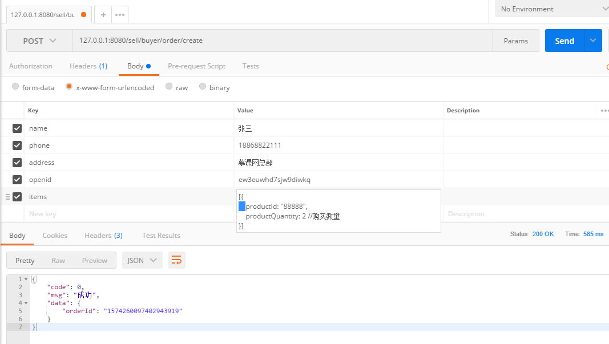
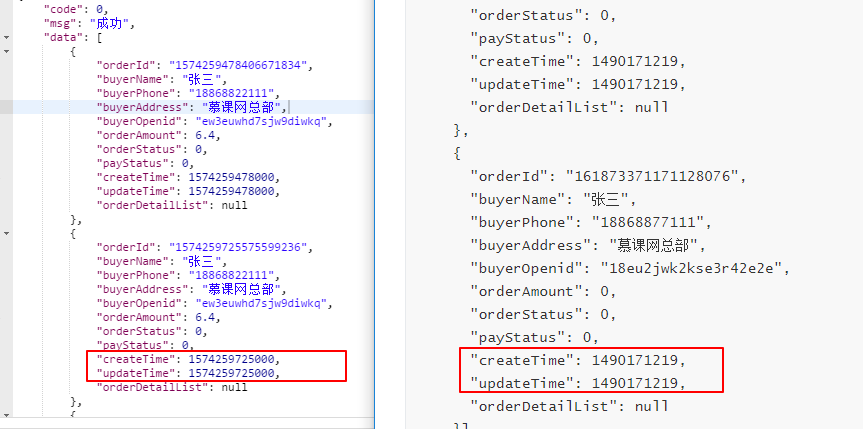
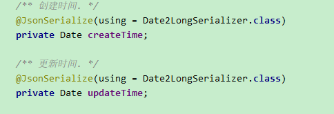

### 创建订单

```
POST /sell/buyer/order/create
```

参数

```
name: "张三"
phone: "18868822111"
address: "慕课网总部"
openid: "ew3euwhd7sjw9diwkq" //用户的微信openid
items: [{
    productId: "1423113435324",
    productQuantity: 2 //购买数量
}]

```

返回

```
{
  "code": 0,
  "msg": "成功",
  "data": {
      "orderId": "147283992738221" 
  }
}
```

#### Controller

~~~java
package com.imooc.controller;

/**
 * @author LB
 * @Remarks 买家订单Controller
 * @date 2019/11/20 21:10
 */
@RestController
@RequestMapping("/buyer/order")
@Slf4j
public class BuyerOrderController {

    @Autowired
    private OrderService orderService;

    //创建订单
    //@Valid 表单验证
    @PostMapping("/create")
    public ResultVO<Map<String,String>> create(@Valid OrderForm orderForm, BindingResult bindingResult){
        if(bindingResult.hasErrors()){
            log.error("【创建订单】参数不正确，orderForm={}",orderForm);
            throw new SellException(ResultEnum.PARAM_ERROR.getCode(),bindingResult.getFieldError().getDefaultMessage());
        }
        OrderDTO orderDTO = OrderForm2OrderDTOConverter.convert(orderForm);
        if(CollectionUtils.isEmpty(orderDTO.getOrderDetailList())){
            log.error("【创建订单】购物车不能为空");
            throw new SellException(ResultEnum.CART_EMPTY);
        }

        OrderDTO createResult = orderService.create(orderDTO);

        Map<String, String> map = new HashMap<>();
        map.put("orderId",createResult.getOrderId());

        return ResultVOUtil.success(map);
    }

    //订单列表

    //订单详情

    //取消订单

}

~~~

#### Service

```java
package com.imooc.service.impl;

/**
 * @author LB
 * @Remarks
 * @date 2019/11/06 22:40
 */
@Service
public class OrderServiceImpl implements OrderService {

    //商品表service
    @Autowired
    private ProductService productService;

    //订单详情表
    @Autowired
    private OrderDetailRepository orderDetailRepository;

    //操作订单表
    @Autowired
    private OrderMasterRepository orderMasterRepository;

  
    /** 创建订单. */
    @Override
    @Transactional
    public OrderDTO create(OrderDTO orderDTO) {

        String orderId = KeyUtil.genUniqueKey();
        //定义一个总价
        BigDecimal orderAmount = new BigDecimal(BigInteger.ZERO);

//        List<CartDTO> cartDTOList = new ArrayList<>();

        //1.查询商品（数量，价格）
            //1.1 遍历前端传过来的商品
        for (OrderDetail orderDetail : orderDTO.getOrderDetailList()) {
            //商品表
            ProductInfo productInfo = productService.findOne(orderDetail.getProductId());
            if(productInfo == null){
                //商品不存在
                throw new SellException(ResultEnum.PRODUCT_NOT_EXIST);
            }
            //2.计算总价
                //商品价格*商品数量+总价
            orderAmount = productInfo.getProductPrice()
                    .multiply(new BigDecimal(orderDetail.getProductQuantity()))
                    .add(orderAmount);

            //订单详情入库
                //设置订单详情Id
            orderDetail.setDetailId(KeyUtil.genUniqueKey());
            orderDetail.setOrderId(orderId);
            BeanUtils.copyProperties(productInfo,orderDetail);
            orderDetailRepository.save(orderDetail);
//            CartDTO cartDTO = new CartDTO(orderDetail.getProductId(), orderDetail.getProductQuantity());
//            cartDTOList.add(cartDTO);
        }
        //3.写入订单数据库（orderMaster和orderDetail）
        OrderMaster orderMaster = new OrderMaster();
        //设置订单Id
        orderDTO.setOrderId(orderId);
        //把orderDTO的属性拷贝给orderMaster
        BeanUtils.copyProperties(orderDTO,orderMaster);
        //设置订单总金额
        orderMaster.setOrderAmount(orderAmount);
        //设置订单状态
        orderMaster.setOrderStatus(OrderStatusEnum.NEW.getCode());
        //设置支付状态
        orderMaster.setPayStatus(PayStatusEnum.WAIT.getCode());
        //存入数据库
        orderMasterRepository.save(orderMaster);
        //4.扣库存
        List<CartDTO> cartDTOList = orderDTO.getOrderDetailList().stream().map(e ->
                new CartDTO(e.getProductId(), e.getProductQuantity())
        ).collect(Collectors.toList());

        productService.decreaseStock(cartDTOList);

        return orderDTO;
    }

```

#### Dao

```java
/** *  操作订单详情 */
public interface OrderDetailRepository extends JpaRepository<OrderDetail,String> {
    //根据订单Id查询
    List<OrderDetail> findByOrderId(String orderId);
}
```

```java
/** * 操作订单表 */
public interface OrderMasterRepository extends JpaRepository<OrderMaster,String> {   
    //根据买家ID查询    
    Page<OrderMaster> findByBuyerOpenid(String buyerOpenid, Pageable pageable);
}
```

#### 测试



### 查询订单列表

### Controller

```java

    //订单列表
    @GetMapping("/list")
    public ResultVO<List<OrderDTO>> list (@RequestParam("openid") String openid,
                                          //如果为空设置默认值为0
                                          @RequestParam(value = "page",defaultValue = "0") Integer page,
                                          @RequestParam(value = "size",defaultValue = "10") Integer size){
        if(StringUtils.isEmpty(openid)){
           log.error("【查询订单列表】openid为空");
           throw new SellException(ResultEnum.PARAM_ERROR);
        }

        PageRequest pageRequest = new PageRequest(page,size);
        Page<OrderDTO> orderDTOPage = orderService.findList(openid, pageRequest);

        return ResultVOUtil.success(orderDTOPage.getContent());
    }

```

#### server

```java
 /** 查询订单列表. */
    @Override
    public Page<OrderDTO> findList(String buyerOpenid, Pageable pageable) {
        Page<OrderMaster> orderMasterPage = orderMasterRepository.findByBuyerOpenid(buyerOpenid, pageable);
        //OrderMasterList 转 orderDTOList
        List<OrderDTO> orderDTOList = OrderMaster2OrderDTOConverter.convert(orderMasterPage.getContent());
        return new PageImpl<>(orderDTOList, pageable, orderMasterPage.getTotalPages());
    }
```

#### OrderMasterList 转 orderDTOList

```java

/**
 * @author LB
 * @Remarks 
 * @date 2019/11/12 23:50
 */
//OrderMasterList 转 orderDTOList
public class OrderMaster2OrderDTOConverter {
    //OrderMaster 订单表
    public static OrderDTO convert(OrderMaster orderMaster){
        OrderDTO orderDTO = new OrderDTO();
        BeanUtils.copyProperties(orderMaster,orderDTO);
        return orderDTO;
    }

    public static List<OrderDTO> convert(List<OrderMaster> orderMasterList){
        return orderMasterList.stream().map(e ->
                convert(e)
                ).collect(Collectors.toList());
    }

}

```

#### Dao

```java

/**
 * 操作订单表
 */
public interface OrderMasterRepository extends JpaRepository<OrderMaster,String> {
    //根据买家ID查询
    Page<OrderMaster> findByBuyerOpenid(String buyerOpenid, Pageable pageable);
}

```
### 一.问题点（去掉多余的0）

需要的数据是时间戳单位为秒，返回的确是毫秒，需要在后台去掉后面的3个0



解决办法

1.添加一个类继承JsonSerializer

```java
package com.imooc.utils.serializer;

import com.fasterxml.jackson.core.JsonGenerator;
import com.fasterxml.jackson.core.JsonProcessingException;
import com.fasterxml.jackson.databind.JsonSerializer;
import com.fasterxml.jackson.databind.SerializerProvider;

import java.io.IOException;
import java.util.Date;

/**
 * @author LB
 * @Remarks
 * @date 2019/11/21 20:55
 */
public class Date2LongSerializer extends JsonSerializer<Date> {
    @Override
    public void serialize(Date date, JsonGenerator jsonGenerator, SerializerProvider serializerProvider) throws IOException, JsonProcessingException {
        jsonGenerator.writeNumber(date.getTime()/1000);
    }
}

```

在字段上加注解




```java
package com.imooc.dto;

import com.fasterxml.jackson.annotation.JsonIgnore;
import com.fasterxml.jackson.databind.annotation.JsonSerialize;
import com.imooc.dataobject.OrderDetail;
import com.imooc.enums.OrderStatusEnum;
import com.imooc.enums.PayStatusEnum;
import com.imooc.utils.EnumUtil;
import com.imooc.utils.serializer.Date2LongSerializer;
import lombok.Data;

import java.math.BigDecimal;
import java.util.Date;
import java.util.List;

@Data
//@JsonSerialize(include = JsonSerialize.Inclusion.NON_NULL)
//@JsonInclude(JsonInclude.Include.NON_NULL)
public class OrderDTO {

    /** 订单id. */
    private String orderId;

    /** 买家名字. */
    private String buyerName;

    /** 买家手机号. */
    private String buyerPhone;

    /** 买家地址. */
    private String buyerAddress;

    /** 买家微信Openid. */
    private String buyerOpenid;

    /** 订单总金额. */
    private BigDecimal orderAmount;

    /** 订单状态, 默认为0新下单. */
    private Integer orderStatus;

    /** 支付状态, 默认为0未支付. */
    private Integer payStatus;

    /** 创建时间. */
    @JsonSerialize(using = Date2LongSerializer.class)
    private Date createTime;

    /** 更新时间. */
    @JsonSerialize(using = Date2LongSerializer.class)
    private Date updateTime;

    List<OrderDetail> orderDetailList;

    @JsonIgnore
    public OrderStatusEnum getOrderStatusEnum() {
        return EnumUtil.getByCode(orderStatus, OrderStatusEnum.class);
    }

    @JsonIgnore
    public PayStatusEnum getPayStatusEnum() {
        return EnumUtil.getByCode(payStatus, PayStatusEnum.class);
    }
}

```


### 取消订单

### Controller

```java

    //取消订单
    @GetMapping("cancel")
    public ResultVO<OrderDTO> cancel(@RequestParam("openid") String openid,
                                     @RequestParam("orderid") String orderid){
        //TODO 不安全的做法需要改进
        OrderDTO orderDTO = orderService.findOne(orderid);
        orderService.cancel(orderDTO);
        return ResultVOUtil.success();
    }

```

#### service

```java
package com.imooc.service.impl;
/**
 * @author LB
 * @Remarks
 * @date 2019/11/06 22:40
 */
@Service
@Slf4j
public class OrderServiceImpl implements OrderService {

    //商品表service
    @Autowired
    private ProductService productService;

    //订单详情表
    @Autowired
    private OrderDetailRepository orderDetailRepository;

    //操作订单表
    @Autowired
    private OrderMasterRepository orderMasterRepository;

    /** 取消订单*/
    @Override
    public OrderDTO cancel(OrderDTO orderDTO) {
        OrderMaster orderMaster = new OrderMaster();
        //1.判断订单状态
        if(!orderDTO.getOrderStatus().equals(OrderStatusEnum.NEW.getCode())){
            log.error("【取消订单】订单状态不正确,orderId={},orderStatus={}",orderDTO.getOrderId(),orderDTO.getOrderStatus());
            throw new SellException(ResultEnum.PRODUCT_STATUS_ERROR);
        }
        //2.修改订单状态
        orderDTO.setOrderStatus(OrderStatusEnum.CANCEL.getCode());
        BeanUtils.copyProperties(orderDTO,orderMaster);
        OrderMaster updateResult = orderMasterRepository.save(orderMaster);
        if(updateResult == null){
            log.error("【取消订单】更新失败,orderMaster={}",orderMaster);
            throw new SellException(ResultEnum.ORDER_UPDATE_FAIL);
        }
        //3.返回库存
        if(CollectionUtils.isEmpty(orderDTO.getOrderDetailList())){
            log.error("【取消订单】订单中无商品详情,orderDTO={}",orderDTO);
            throw new SellException(ResultEnum.ORDER_DETAIL_EMPTY);
        }
        List<CartDTO> cartDTOList =  orderDTO.getOrderDetailList().stream()
                .map(e -> new CartDTO(e.getProductId(),e.getProductQuantity()))
                .collect(Collectors.toList());
        //3.1加库存
        productService.increaseStock(cartDTOList);
        //4.如果已经支付，需要退款
        if(orderDTO.getOrderStatus().equals(PayStatusEnum.SUCCESS.getCode())){
            //TODO
        }
        return orderDTO;
    }

}

```

#### Dao

```java
package com.imooc.service.impl;
/**
 * @author LB
 * @Remarks 商品
 * @date 2019/11/02 16:14
 */
@Service
public class ProductServiceImpl implements ProductService {

    @Autowired
    private ProductInfoRepository repository;
    //加库存
    @Override
    @Transactional
    public void increaseStock(List<CartDTO> cartDTOList) {
        for (CartDTO cartDTO : cartDTOList) {
            ProductInfo productInfo = repository.findOne(cartDTO.getProductId());
            //如果不存在
            if(productInfo == null){
                throw new SellException(ResultEnum.PRODUCT_NOT_EXIST);
            }
            Integer result = productInfo.getProductStock()+cartDTO.getProductQuantity();
            productInfo.setProductStock(result);
            repository.save(productInfo);
        }
    }

}

```

```java
package com.imooc.repository;

import com.imooc.dataobject.OrderMaster;
import org.springframework.data.domain.Page;
import org.springframework.data.domain.Pageable;
import org.springframework.data.jpa.repository.JpaRepository;

/**
 * 操作订单表
 */
public interface OrderMasterRepository extends JpaRepository<OrderMaster,String> {
    //根据买家ID查询
    Page<OrderMaster> findByBuyerOpenid(String buyerOpenid, Pageable pageable);
}

```

### 完结订单

```java
  /** 完结订单. */
    @Override
    public OrderDTO finish(OrderDTO orderDTO) {
        OrderMaster orderMaster = new OrderMaster();

        //判断订单状态
        if(!orderDTO.getOrderStatus().equals(OrderStatusEnum.NEW.getCode())){
            log.error("【完结订单】订单状态不正确,orderId={},orderStatus={}",orderDTO.getOrderId(),orderDTO.getOrderStatus());
            throw new SellException(ResultEnum.PRODUCT_STATUS_ERROR);
        }
        //修改订单状态
        orderDTO.setOrderStatus(OrderStatusEnum.FINISHED.getCode());
        BeanUtils.copyProperties(orderDTO,orderMaster);
        OrderMaster updateResult = orderMasterRepository.save(orderMaster);
        if(updateResult == null){
            log.error("【完结订单】更新失败,orderMaster={}",orderMaster);
            throw new SellException(ResultEnum.ORDER_UPDATE_FAIL);
        }
        return orderDTO;
    }

```


### 支付订单 修改支付状态

```java

    /** 支付订单 修改支付状态 */
    @Override
    @Transactional
    public OrderDTO paid(OrderDTO orderDTO) {
        //判断订单状态(订单状态要为新订单，不然就报错)
        if(!orderDTO.getOrderStatus().equals(OrderStatusEnum.NEW.getCode())){
            log.error("【订单支付完成】订单状态不正确,orderId={},orderStatus={}",orderDTO.getOrderId(),orderDTO.getOrderStatus());
            throw new SellException(ResultEnum.PRODUCT_STATUS_ERROR);
        }
        //判断支付状态(支付状态要为等待支付，不然就报错)
        if(!orderDTO.getPayStatus().equals(PayStatusEnum.WAIT.getCode())){
            log.error("【订单支付完成】支付状态不正确,orderId={},payStatus={}",orderDTO.getOrderId(),orderDTO.getPayStatus());
            throw new SellException(ResultEnum.PRODUCT_STATUS_ERROR);
        }
        //修改支付状态
        orderDTO.setPayStatus(PayStatusEnum.SUCCESS.getCode());
        OrderMaster orderMaster = new OrderMaster();
        BeanUtils.copyProperties(orderDTO,orderMaster);
        OrderMaster updateResult = orderMasterRepository.save(orderMaster);
        if(updateResult == null){
            log.error("【订单支付完成】更新失败，orderMaster={}",orderMaster);
            throw new SellException(ResultEnum.ORDER_UPDATE_FAIL);
        }
        return orderDTO;
    }

```

