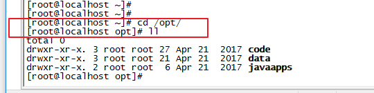

```java

    
cd code/
    
ll

cd sell_fe_buyer/
    
pwd    打印路径


```

```java
cd /opt/
ll    
```



```java
cd code/
ll    
```


```java
cd sell_fe_buyer/
ll    
```
前端代码


完整路径

```java
pwd
```


进入 config

```java
cd config/
ll    
```


编辑index.js

```java
vim index.js
```


把项目地址和获取openId地址修改成自己的地址，保存

```java
项目地址：sell.com
获取openid地址：http://lb888.natapp1.cc/wechat/authorize
```


```java
cd ..回到前端项目根目录
```


```java
npm run build 打包项目
```


```java
ls -al dist/  打包好的文件在这个目录下
```


```java
把打包好的文件拷贝到网站根目录下
cp -r dist/* /opt/data/wwwroot/sell/
```


提示是否覆盖，选择y


