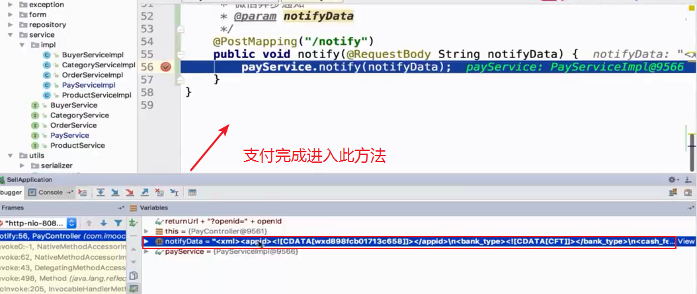

### 一.调用统一下单API,返回预付单信息

#### 配置文件准备

JSAPi支付开发文档`https://pay.weixin.qq.com/wiki/doc/api/jsapi.php?chapter=7_4`

引入第三方微信支付SDK

```java
		<dependency>
			<groupId>cn.springboot</groupId>
			<artifactId>best-pay-sdk</artifactId>
			<version>1.1.0</version>
		</dependency>
```

获取微信的配置

```java
wechat:
  mpAppId: wxd898fcb01713c658 #公众平台id
  mpAppSecret: 29d8a650db31472aa8789oe3bod739f2 #公众平台密钥
  openAppId: wx6ad144e54af67d87 #开放平台id
  openAppSecret: 91a2ff6d38a2bbccfb7e9f9079108e2e #开放平台密钥
  mchId: 1409146202 #商户号
  mchKey: c976503d34ca432c601361f969fd8d85 #商户密钥
  keyPath: C:/IDEA_WorkSpace/wechat_order/weixin-sell/lbsell/src/main/resources/static/var/h5.p12 #商户证书路径
  notifyUrl: http://sell.natapp4.cc/sell/pay/notify #微信支付异步通知地址
projectUrl:
  wechatMpAuthorize: http://lb888.natapp1.cc
  wechatOpenAuthorize: http://lb888.natapp1.cc
  sell: http://lb888.natapp1.cc
```


```java
package com.imooc.config;

import lombok.Data;
import org.springframework.boot.context.properties.ConfigurationProperties;
import org.springframework.stereotype.Component;

import java.util.Map;

/**
 * @author LB
 * @Remarks
 * @date 2019/11/27 23:00
 */
@Data
@Component
@ConfigurationProperties(prefix = "wechat")
public class WechatAccountConfig {

    /**
     * 公众平台id
     */
    private String mpAppId;

    /**
     * 公众平台密钥
     */
    private String mpAppSecret;

    /**
     * 开放平台id
     */
    private String openAppId;

    /**
     * 开放平台密钥
     */
    private String openAppSecret;

    /**
     * 商户号
     */
    private String mchId;

    /**
     * 商户密钥
     */
    private String mchKey;

    /**
     * 商户证书路径
     */
    private String keyPath;

    /**
     * 微信支付异步通知地址
     */
    private String notifyUrl;

    /**
     * 微信模版id
     */
    private Map<String, String> templateId;
}

```

配置Bean

```java
package com.imooc.config;

import com.lly835.bestpay.config.WxPayH5Config;
import com.lly835.bestpay.service.impl.BestPayServiceImpl;
import org.springframework.beans.factory.annotation.Autowired;
import org.springframework.context.annotation.Bean;
import org.springframework.stereotype.Component;

/**
 * @author LB
 * @Remarks
 * @date 2019/12/29 17:00
 */
@Component
public class WechatPayConfig {

    @Autowired
    private WechatAccountConfig accountConfig;

    @Bean
    public BestPayServiceImpl bestPayService(){
        BestPayServiceImpl bestPayService = new BestPayServiceImpl();
        bestPayService.setWxPayH5Config(wxPayH5Config());
        return bestPayService;
    }

    @Bean
    public WxPayH5Config wxPayH5Config() {
        WxPayH5Config wxPayH5Config = new WxPayH5Config();
        wxPayH5Config.setAppId(accountConfig.getMpAppId());//公众平台id
        wxPayH5Config.setAppSecret(accountConfig.getMpAppSecret());//公众平台密钥
        wxPayH5Config.setMchId(accountConfig.getMchId());//商户号
        wxPayH5Config.setMchKey(accountConfig.getMchKey());//商户秘钥
        wxPayH5Config.setKeyPath(accountConfig.getKeyPath());//商户证书路径
        wxPayH5Config.setNotifyUrl(accountConfig.getNotifyUrl());//微信支付异步通知地址
        return wxPayH5Config;
    }
}

```

#### 测试配置文件是否生效

编写package com.imooc.controller.PayController

```java
package com.imooc.controller;

import com.imooc.dto.OrderDTO;
import com.imooc.enums.ResultEnum;
import com.imooc.exception.SellException;
import com.imooc.service.OrderService;
import org.springframework.beans.factory.annotation.Autowired;
import org.springframework.stereotype.Controller;
import org.springframework.web.bind.annotation.GetMapping;
import org.springframework.web.bind.annotation.RequestMapping;
import org.springframework.web.bind.annotation.RequestParam;

/**
 * @author LB
 * @Remarks 支付
 * @date 2019/11/28 22:21
 */
@Controller
@RequestMapping("/pay")
public class PayController {

    @Autowired
    private OrderService orderService;

    @GetMapping("/create")
    public void create (@RequestParam("orderId") String orderId,
                        @RequestParam("returnUrl") String returnUrl){
        //1.查询订单
        OrderDTO orderDTO = orderService.findOne(orderId);
        if(orderDTO == null){
            throw new SellException(ResultEnum.PRODUCT_NOT_EXIST);
        }
        //发起支付

    }
}

```

PayServiceImpl

```java
package com.imooc.service.impl;

import com.imooc.dto.OrderDTO;
import com.imooc.service.PayService;
import com.lly835.bestpay.enums.BestPayTypeEnum;
import com.lly835.bestpay.model.PayRequest;
import com.lly835.bestpay.model.PayResponse;
import com.lly835.bestpay.service.impl.BestPayServiceImpl;
import com.lly835.bestpay.utils.JsonUtil;
import lombok.extern.slf4j.Slf4j;
import org.springframework.beans.factory.annotation.Autowired;
import org.springframework.stereotype.Service;

/**
 * @author LB
 * @Remarks
 * @date 2019/11/28 22:37
 */
@Service
@Slf4j
public class PayServiceImpl implements PayService {

    @Autowired(required = false)
    private BestPayServiceImpl bestPayService;

    private static final String ORDER_NAME = "微信点餐订单";

    @Override
    public void create(OrderDTO orderDTO) {
        PayRequest payRequest = new PayRequest();
        PayResponse payResponse = bestPayService.pay(payRequest);
    }
}

```

编写测试类

```java
import static org.junit.Assert.*;

@RunWith(SpringRunner.class)
@SpringBootTest
@Slf4j
public class PayServiceImplTest {

    @Autowired
    private PayService payService;

    @Autowired
    private OrderService orderService;

    @Test
    public void create() {
        OrderDTO orderDTO = orderService.findOne("1573488015486349818");
        payService.create(orderDTO);
    }
}
```

运行测试方法，确认刚刚配置的测试类已经被写入，继续下一步


####  编写发起支付需要传的参

PayServiceImpl编写发起支付需要传的参数

```java
package com.imooc.service.impl;

import com.imooc.dto.OrderDTO;
import com.imooc.service.PayService;
import com.lly835.bestpay.enums.BestPayTypeEnum;
import com.lly835.bestpay.model.PayRequest;
import com.lly835.bestpay.model.PayResponse;
import com.lly835.bestpay.service.impl.BestPayServiceImpl;
import com.lly835.bestpay.utils.JsonUtil;
import lombok.extern.slf4j.Slf4j;
import org.springframework.beans.factory.annotation.Autowired;
import org.springframework.stereotype.Service;

/**
 * @author LB
 * @Remarks
 * @date 2019/11/28 22:37
 */
@Service
@Slf4j
public class PayServiceImpl implements PayService {

    @Autowired(required = false)
    private BestPayServiceImpl bestPayService;

    private static final String ORDER_NAME = "微信点餐订单";

    @Override
    public PayResponse create(OrderDTO orderDTO) {
        PayRequest payRequest = new PayRequest();
        //OpenId
        payRequest.setOpenid(orderDTO.getBuyerOpenid());
        //金额
        payRequest.setOrderAmount(orderDTO.getOrderAmount().doubleValue());
        //订单号
        payRequest.setOrderId(orderDTO.getOrderId());
        //订单名称
        payRequest.setOrderName(ORDER_NAME);
        //支付类型
        payRequest.setPayTypeEnum(BestPayTypeEnum.WXPAY_H5);
        log.info("【微信支付】发起支付, request={}", JsonUtil.toJson(payRequest));
        PayResponse payResponse = bestPayService.pay(payRequest);
        log.info("【微信支付】发起支付, response={}", JsonUtil.toJson(payResponse));
        return payResponse;
    }
}

```

编写完成，运行测试类。得到结果


### 二.微信内H5调起支付


粘贴 上图的js代码到pay.html


```java
<script>
    function onBridgeReady(){
        WeixinJSBridge.invoke(
            'getBrandWCPayRequest', {
                "appId":"wx2421b1c4370ec43b",     //公众号名称，由商户传入
                "timeStamp":"1395712654",         //时间戳，自1970年以来的秒数
                "nonceStr":"e61463f8efa94090b1f366cccfbbb444", //随机串
                "package":"prepay_id=u802345jgfjsdfgsdg888",//预支付交易会话标识
                "signType":"MD5",         //微信签名方式：
                "paySign":"70EA570631E4BB79628FBCA90534C63FF7FADD89" //微信签名
            },
            function(res){
                if(res.err_msg == "get_brand_wcpay_request:ok" ){
                    // 使用以上方式判断前端返回,微信团队郑重提示：
                    //res.err_msg将在用户支付成功后返回ok，但并不保证它绝对可靠。
                }
            });
    }
    if (typeof WeixinJSBridge == "undefined"){
        if( document.addEventListener ){
            document.addEventListener('WeixinJSBridgeReady', onBridgeReady, false);
        }else if (document.attachEvent){
            document.attachEvent('WeixinJSBridgeReady', onBridgeReady);
            document.attachEvent('onWeixinJSBridgeReady', onBridgeReady);
        }
    }else{
        onBridgeReady();
    }
</script>

```

浏览器访问pay.html,可以访问到


打开内网穿透，使用内网访问，也可访问。接下来我们在微信端访问


在微信端访问提示，缺少参数


这里说缺少参数total_fee其实是因为prepay_id不正确。需要使用在统一下单接口获取的prepay_id


填写后继续在微信端访问，访问后报如下的错误


在微信公众号中配置授权目录，解决这个问题


继续在微信中访问连接，此时跳到支付页面


#### 动态注入参数发起支付

引入freemarker依赖

```java
		<dependency>
			<groupId>org.springframework.boot</groupId>
			<artifactId>spring-boot-starter-freemarker</artifactId>
		</dependency>
```

新建并编写前端页面


修改PayController

```java
package com.imooc.controller;

import com.imooc.dto.OrderDTO;
import com.imooc.enums.ResultEnum;
import com.imooc.exception.SellException;
import com.imooc.service.OrderService;
import org.springframework.beans.factory.annotation.Autowired;
import org.springframework.stereotype.Controller;
import org.springframework.web.bind.annotation.GetMapping;
import org.springframework.web.bind.annotation.RequestMapping;
import org.springframework.web.bind.annotation.RequestParam;
import org.springframework.web.servlet.ModelAndView;

/**
 * @author LB
 * @Remarks 支付
 * @date 2019/11/28 22:21
 */
@Controller
@RequestMapping("/pay")
public class PayController {

    @Autowired
    private OrderService orderService;

    @GetMapping("/create")
    public ModelAndView create (@RequestParam("orderId") String orderId,
                        @RequestParam("returnUrl") String returnUrl){
        //1.查询订单
        OrderDTO orderDTO = orderService.findOne(orderId);
        if(orderDTO == null){
            throw new SellException(ResultEnum.PRODUCT_NOT_EXIST);
        }
        //发起支付
        return new ModelAndView("pay/create");
    }
}

```

访问，前端可以正常访问


优化PayController

```java
package com.imooc.controller;

import com.imooc.dto.OrderDTO;
import com.imooc.enums.ResultEnum;
import com.imooc.exception.SellException;
import com.imooc.service.OrderService;
import com.imooc.service.PayService;
import com.lly835.bestpay.model.PayResponse;
import org.springframework.beans.factory.annotation.Autowired;
import org.springframework.stereotype.Controller;
import org.springframework.web.bind.annotation.GetMapping;
import org.springframework.web.bind.annotation.RequestMapping;
import org.springframework.web.bind.annotation.RequestParam;
import org.springframework.web.servlet.ModelAndView;

import java.util.Map;

/**
 * @author LB
 * @Remarks 支付
 * @date 2019/11/28 22:21
 */
@Controller
@RequestMapping("/pay")
public class PayController {

    @Autowired
    private OrderService orderService;

    @Autowired
    private PayService payService;

    @GetMapping("/create")
    public ModelAndView create (@RequestParam("orderId") String orderId,
                        @RequestParam("returnUrl") String returnUrl,
                                Map<String, Object> map){
        //1.查询订单
        OrderDTO orderDTO = orderService.findOne(orderId);
        if(orderDTO == null){
            throw new SellException(ResultEnum.PRODUCT_NOT_EXIST);
        }
        //发起支付
        PayResponse payResponse = payService.create(orderDTO);

        map.put("payResponse", payResponse);
        map.put("returnUrl", returnUrl);
        return new ModelAndView("pay/create",map);
    }
}

```

编写create.ftl

```java
<script>
    function onBridgeReady(){
        WeixinJSBridge.invoke(
            'getBrandWCPayRequest', {
                "appId":"${payResponse.appId}",     //公众号名称，由商户传入
                "timeStamp":"${payResponse.timeStamp}",         //时间戳，自1970年以来的秒数
                "nonceStr":"${payResponse.nonceStr}", //随机串
                "package":"${payResponse.packAge}",
                "signType":"MD5",         //微信签名方式：
                "paySign":"${payResponse.paySign}" //微信签名
            },
            function(res){
//                    if(res.err_msg == "get_brand_wcpay_request:ok" ) {

//                    }     // 使用以上方式判断前端返回,微信团队郑重提示：res.err_msg将在用户支付成功后返回    ok，但并不保证它绝对可靠。
                location.href = "${returnUrl}";
            }
        );
    }
    if (typeof WeixinJSBridge == "undefined"){
        if( document.addEventListener ){
            document.addEventListener('WeixinJSBridgeReady', onBridgeReady, false);
        }else if (document.attachEvent){
            document.attachEvent('WeixinJSBridgeReady', onBridgeReady);
            document.attachEvent('onWeixinJSBridgeReady', onBridgeReady);
        }
    }else{
        onBridgeReady();
    }
</script>
```

 编写完成，打开微信访问

`http://lb888.natapp1.cc/sell/pay/create?orderId=123459&returnUrl=wwww.ssss.com`

跳到支付页面并且支付成功


和前端项目进行测试


这里支付按钮点不了


需要修改前端代码，进入虚拟机

进入前端代码目录，修改index.js

```java
cd /opt/code/
ll
cd sell_fe_buyer/
ll
pwd
cd config/
ll
vim index.js
```


这里改为我们的支付Controller


保存并退出

重新打包前端代码

```java
cd ..
ll
npm run build

```


把打包好的代码拷贝到项目目录

```java
cp -r dist/* /opt/data/wwwroot/sell
```


此时进入页面，已经可以点支付。但是支付完成还没有修改订单状态


### 三.微信异步通知


`package com.imooc.controller.PayController`;

```java
    /**
     * 微信异步通知
     * @param notifyData
     */
    @PostMapping("/notify")
    public ModelAndView notify(@RequestBody String notifyData) {
        payService.notify(notifyData);
        //返回给微信处理结果
        return new ModelAndView("pay/success");
    }
```


`package com.imooc.service.impl.PayServiceImpl`

```java
   @Override
    public PayResponse notify(String notifyData) {
        PayResponse payResponse = bestPayService.asyncNotify(notifyData);
        log.info("【微信支付】异步通知, payResponse={}", JsonUtil.toJson(payResponse));
        return payResponse;
    }
```


###### 测试

在微信端点击支付，支付完成进入notify方法



得到一串字符 notifyData


```java
<xml>
<appid><! [CDATA [wxd898fcb01713c658]]></appid>
<bank_type><! [CDATA[CFT]]></bank_type>
<cash fee><! [CDATA [1]]></cash fee>
<fee_type><! [CDATA [CNY]]></fee_type>
<is subscribe><! [CDATA[Y]]></is subscribe>
<mch id><! [CDATA[1483469312]1 ></mch id>
<nonce Str><! [CDATA [XV1HUCC1IVCRMRRM]]</nonce str>
<openid><! [CDATA[otgzpwennfiva9er9eixoh-jlrwq1></openid>
<Out trade no><![[CDATA[1499588542774769972]]><out trade no>     订单号
<result code><! [CDATA [SUCCESS]]></result_Code>
<return code><! [CDATA [SUCCESS]></return code>
<sign><! [CDATA [0LDC00DCD9CBBAF7578F80C298BDF648]]></sign>
<time end><! [CDATA [20170709162206]]></time end>
<total fee>1</total fee>
<trade_type><! [CDATA[JSAPI]]></trade_type>
<transaction id><! [CDATA [4002462001201707099758181735]]></transaction id>  流水号
</xml>
```

继续完善接收异步通知的代码 

`package com.imooc.service.impl.PayServiceImpl`

验证签名和判断支付状态 

`PayResponse payResponse = bestPayService.asyncNotify(notifyData);`

 第三方SDK提供的方法里已经帮我们完成

```java

    @Override
    public PayResponse notify(String notifyData) {
        //1. 验证签名
        //2. 支付的状态
        //3. 支付金额
        //4. 支付人(下单人 == 支付人)
        PayResponse payResponse = bestPayService.asyncNotify(notifyData);
        log.info("【微信支付】异步通知, payResponse={}", JsonUtil.toJson(payResponse));

        //查询订单
        OrderDTO orderDTO = orderService.findOne(payResponse.getOrderId());

        //判断订单是否存在
        if (orderDTO == null) {
            log.error("【微信支付】异步通知, 订单不存在, orderId={}", payResponse.getOrderId());
            throw new SellException(ResultEnum.ORDER_NOT_EXIST);
        }

        //判断金额是否一致(0.10   0.1)
        if (!orderDTO.getOrderAmount().equals(payResponse.getOrderAmount())) {
            log.error("【微信支付】异步通知, 订单金额不一致, orderId={}, 微信通知金额={}, 系统金额={}",
                    payResponse.getOrderId(),
                    payResponse.getOrderAmount(),
                    orderDTO.getOrderAmount());
            throw new SellException(ResultEnum.WXPAY_NOTIFY_MONEY_VERIFY_ERROR);
        }
        return payResponse;
    }
```

#####  测试

在微信端点击支付，支付完成进入notify方法。我们来看看刚才写的代码是否正确


#####  问题： 报错了，但是日志打印的微信通知金额和系统金额是一致的，这是什么原因呢？


原因是orderDTO的金额是BigDecimal类型而payPesponse的金额是Double类型

这里再介绍一种错误的判断方法，


两个BigDecimal数相减== 0 就说明相等。为什么这种判断方法不行？

因为精度不一致，一个值是0.01，另一个值是0.0100000000032344

解决办法，我们写一个判断金额是否相等的工具类:两个金额相减，如果小于值小于0.01就判断为相等

```java
public class MathUtil {
    private static final Double MONEY_RANGE = 0.01;
    /**
     * 比较2个金额是否相等
     * @param d1
     * @param d2
     * @return
     */
    public static Boolean equals(Double d1, Double d2) {
        Double result = Math.abs(d1 - d2);
        if (result < MONEY_RANGE) {
            return true;
        }else {
            return false;
        }
    }
}
```

改好后的`package com.imooc.service.impl.PayServiceImpl`

```java
  @Override
    public PayResponse notify(String notifyData) {
        //1. 验证签名
        //2. 支付的状态
        //3. 支付金额
        //4. 支付人(下单人 == 支付人)
        PayResponse payResponse = bestPayService.asyncNotify(notifyData);
        log.info("【微信支付】异步通知, payResponse={}", JsonUtil.toJson(payResponse));

        //查询订单
        OrderDTO orderDTO = orderService.findOne(payResponse.getOrderId());

        //判断订单是否存在
        if (orderDTO == null) {
            log.error("【微信支付】异步通知, 订单不存在, orderId={}", payResponse.getOrderId());
            throw new SellException(ResultEnum.ORDER_NOT_EXIST);
        }

        //判断金额是否一致(0.10   0.1)
//        if (!orderDTO.getOrderAmount().equals(payResponse.getOrderAmount())) {
//        if (orderDTO.getOrderAmount().compareTo(new BigDecimal(payResponse.getOrderAmount())) == 0) {
            if (!MathUtil.equals(payResponse.getOrderAmount(), orderDTO.getOrderAmount().doubleValue())) {
            log.error("【微信支付】异步通知, 订单金额不一致, orderId={}, 微信通知金额={}, 系统金额={}",
                    payResponse.getOrderId(),
                    payResponse.getOrderAmount(),
                    orderDTO.getOrderAmount());
            throw new SellException(ResultEnum.WXPAY_NOTIFY_MONEY_VERIFY_ERROR);
        }
        
         //修改订单的支付状态
        orderService.paid(orderDTO);
        
        return payResponse;
    }
```

##### 修改完订单的支付状态后，需要给微信返回一个处理结果，不然微信会一直调用支付回调方法

其实就是返回给微信一个字符串(官方文档AP列表，支付结果通知里可以找到这个字符串)

```java
<xml>
    <return_code><![CDATA[SUCCESS]]></return_code>
    <return_msg><![CDATA[OK]]></return_msg>
</xml>
```


为了美观，这里我们把字符串以页面的形式返回


### 四.微信退款

进入商户平台，下载证书


下载好的证书


放到一个可以访问的路径


`package com.imooc.service.impl.PayServiceImpl;`

```java
    /**
     * 退款
     * @param orderDTO
     */
    @Override
    public RefundResponse refund(OrderDTO orderDTO) {
        RefundRequest refundRequest = new RefundRequest();
        refundRequest.setOrderId(orderDTO.getOrderId());//商户订单号
        refundRequest.setOrderAmount(orderDTO.getOrderAmount().doubleValue());//订单金额
        refundRequest.setPayTypeEnum(BestPayTypeEnum.WXPAY_H5);
        log.info("【微信退款】request={}", JsonUtil.toJson(refundRequest));

        RefundResponse refundResponse = bestPayService.refund(refundRequest);
        log.info("【微信退款】response={}", JsonUtil.toJson(refundResponse));

        return refundResponse;
    }
```

补充取消订单的退款步骤


