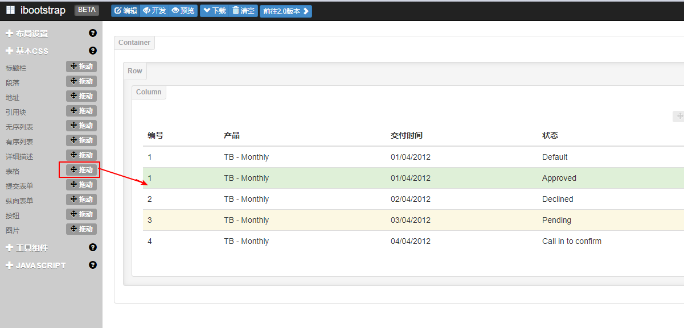

## 前端框架bootstrap使用

进入前端框架页面`http://www.ibootstrap.cn`

拖拽一个12的布局到界面


再拖拽一个表格到布局里



点击下载


引入css，粘贴代码到项目中就可以使用了


## framework在项目中的使用

### list遍历


```java

```

在http://www.ibootstrap.cn粘贴分页代码到项目中


添加一个样式pull-right让分页代码右对齐


##### 遍历总条数


### if判断

```java
        <#list 1..orderDTOPage.getTotalPages() as index>
                    <#if currentPage == index>
                        <li class="disabled"><a href="#"> ${index}</a></li>
                    <#else >
                        <li><a href="#"> ${index}</a></li>
                    </#if>
                 </#list>
```

如果currentPage == index 给list加一个样式disabled表示不可点击


#####　分页

```javascript
  <#--分页-->
        <div class="col-md-12 column">
            <ul class="pagination pull-right">
                <#--class="disabled" 不可点击样式-->

                <#--如果当前页=1  就不可点击-->
                <#if currentPage lte 1>
                      <li class="disabled"><a href="/sell/seller/order/list?page=${currentPage-1}&size=${size}">上一页</a></li>
                <#else >
                      <li><a href="/sell/seller/order/list?page=${currentPage-1}&size=${size}">上一页</a></li>
                </#if>

                 <#list 1..orderDTOPage.getTotalPages() as index>
                    <#if currentPage == index>
                        <li class="disabled"><a href="/sell/seller/order/list?page=${index}&size=${size}"> ${index}</a></li>
                    <#else >
                        <li><a href="/sell/seller/order/list?page=${index}&size=${size}"> ${index}</a></li>
                    </#if>
                 </#list>

                <#--如果当前页>=总页数-->
                <#if currentPage gte orderDTOPage.getTotalPages() >
                    <li class="disabled"><a href="/sell/seller/order/list?page=${currentPage+1}&size=${size}">下一页</a></li>
                <#else>
                    <li><a href="/sell/seller/order/list?page=${currentPage+1}&size=${size}">下一页</a></li>
                </#if>
            </ul>
        </div>
```


