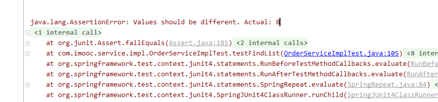

### 断言

判断`orderDTOPage.getTotalElements()`是否不等于8

```java
import org.junit.Assert;

Assert.assertNotEquals(8,orderDTOPage.getTotalElements());
```

如果等于8 就报错

断言错误：值应该不同.实际：8



### @JsonIgnore

在对象的属性上加`@JsonIgnore`注解，对象转JSON时会忽略这个属性

### @JsonProperty

```java

/**
 * 商品(包含类目)
 * Created by 廖师兄
 * 2017-05-12 14:20
 */
@Data
public class ProductVO implements Serializable  {

    private static final long serialVersionUID = -5987681071937539071L;
    //@JsonProperty表示返回前端为name
    @JsonProperty("name")
    private String categoryName;

    @JsonProperty("type")
    private Integer categoryType;

    @JsonProperty("foods")
    private List<ProductInfoVO> productInfoVOList;
}

```


### 对象的复制

一个对象的值复制给另一个拥有相同属性的对象

```java
import org.springframework.beans.BeanUtils;
orderDTO的属性值拷贝给orderMaster
BeanUtils.copyProperties(orderDTO,orderMaster);
```

### @DynamicUpdate  

*//自动更新（动态更新）updatetime*

自动更新时间

